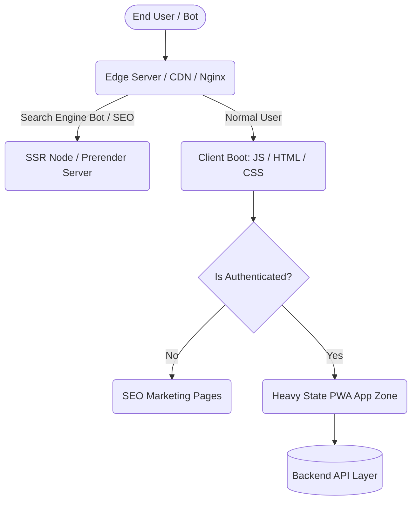

# OUT-1.1_Frontend_Core_Interaction_Waters_Template

> 📂 **阶段主题**: 核心交互水域定性与工程基准判定 (Core Interaction Domain & Application Topology)
> 🧑‍💻 **操作岗位**: 前端首席架构师 (Frontend Architect Agent)
> 🟢 **交接状态**: `[DRAFT | REVIEWING | APPROVED]`
> 📅 **产出时间**: `YYYY-MM-DD`

## 1. 执行摘要 (Executive Summary)

本报告系大前端架构演进的最顶级“定场坐标”。基于对核心商业逻辑的扫板透视，本档案的唯一使命是将业务无情定性为具体的**应用心智模型**（纯文档展示型、重态应用流转、抑或高频渲染大屏）。这一终极定调将直接锁死后续所有的选型预算，凡不符此核心水域特征的技术栈发散，在这阶段即被原地判处“无效重构”死刑。

---

## 2. 宏观基准引索声明 (Single Source of Truth)

> 🔌 **【大盘基准强制连线声明】**
> 本模版中约束的以下前置业务参数（核心受众画像、日均活跃时长预期、核心引流渠道 [SEO依赖度]、设备分布下限），**必须无条件、100% 溯源读取自 `[1_shared_context/Master_Context_Board.md]`**。
> 
> ⚠️ **写作者铁律**：严禁在此处自行推测“我以为不需要 SEO”！如果大盘中关于业务到底是 C 端重展示还是 B 端重操作的宏观定位为空，你必须挂起程序，立刻向业务 Owner 发起探盘查证，并先去老巢【反写并更新大盘上下文】，再来继续填写本清单。
> **[依赖确认项]**：`[] 已从大盘同步客群引流入口特征` | `[] 已从大盘获取并发流量与留存指标设定`

---

## 3. 应用核心态势定性矩阵 (Application Paradigm MECE Matrix)

绝不允许使用模糊的形容词（如“用户体验好”）。以下矩阵要求将系统核心痛点 100% 映射到严苛的工程架构类型象限。

| 应用特征水位线 (Application Paradigm) | 核心驱动因子 (Core Drivers) / SEO要求 | 交互复杂度指征 (Interaction Complexity Index) | 预期主导性能优化域 (Expected Perf Domain) |
| :--- | :--- | :--- | :--- |
| **🔘 静态内容分发型门户 (Content-Heavy / SEO-Driven)** | `[填表处: 极高/中/无]` (如依赖百度/谷歌收录极度沉重) | 低跨页状态耦合，以超链接跳转及首屏快速送达为主 | TTFB (全链路), LCP, FCP 极值优化 |
| **🔘 高密状态流转工作站 (State-Heavy / SaaS App)** | `[填表处: 极高/中/无]` (封闭系统，通常要求强制登录) | 极深度表单联动、复杂的 Context 下钻、跨视图单页网状交互 | 运行期内存管控、DOM 复用、重新渲染防风暴 (Re-render) |
| **🔘 极端高频重绘端 (Render-Heavy / Visualizer)** | `[填表处: 极高/中/无]` (大屏/3D/高频图表/Canvas应用) | WebGL 绘制，长连接 (WS) 高频流式数据注入，每秒 60fps 动画要求 | 主线程 (Main Thread) 解锁、Web-Worker 分流计算 |

*填表 Agent 必做：必须核实各项指标的“高/低”并在此确认当前的唯一主导域，多主导域必须强行排定优先级（如 `State-Heavy > Content-Heavy`）。*

---

## 4. 前端应用系统拓扑与核心入境分流 (Mermaid & Drawio Dual-Track)

本章节定义用户踏入该前端水域后的请求分发与视图装载高层骨架。

> 📌 **【双模轨机制锚定】见脱水可编辑视图与网络骨架源文件：**
> 🔗 `> See: [3_final_outputs/diagrams/OUT-F1.1_App_Entry_Topology.drawio]`

---

## 5. 本阶段判定反向阻断防线 (Anti-Goals / Out of Scope)

本项是对抗“无脑全家桶大乱炖”的终极防线。基于上述定性阶段，本期水域判定边界绝对不卷入以下事情：

- ⛔ **不讨论微观技术选型**：本阶段定性绝对禁止涉及“我是该用 Vue 还是 React”！选型是 Task 3.1 的宿命，此阶段仅输出定性大局（如“我该倾向单页(SPA)还是多页(MPA)”）。
- ⛔ **不越权后端数据库设计**：此处仅定义前端的数据吞吐态势和请求形态（如需要流式推送），禁止在前端 SOP 里去帮后端决定是用 Redis 还是 MQ。
- ⛔ **全盘全场景通吃妄想症**：如果这是一个封闭后台，绝对不在此处编造出任何对于网页自然搜录 (SEO) 优化的支持诉求，一刀切断后续的臃肿基建。

---

## 6. 上下文数据后向流转因果映射表 (Downstream Output Mapping)

这里定义本模版的“宏观定性判决”，将会如何像多米诺骨牌一样击碎或深远改变下游任务的根基：

| 本阶段(Task 1.1)框定的核心水域结论 | 将强制导致下游的哪个阶段 (Task / OUT) 发生骤变与妥协？ | 具体爆炸深层约束逻辑 (Impact Chain) |
| :--- | :--- | :--- |
| **若敲定核心形态为【静态内容门户重 SEO】** | 💥 **强波及** `[Task 3.1 渲染模式推演]` 以及 `[OUT-4.1 DevOps编排]` | 在 Task 3.1 无论用什么花活，都必须推导出包含静态站点生成(SSG)或服务器端渲染(SSR)的结论。前端基础设施将面临引入 Node.js 中台引擎的硬成本。 |
| **若敲定核心形态为【高频重绘看板】** | 💥 **强波及** `[Task 2.2 渲染时序与网络拓扑摸底]` | 在接下来的老项目排雷中，必须强制下放指令要求测量旧系统中针对 `requestAnimationFrame` 和 强制回流 (Forced Reflow) 的内存泄漏点，将其定位最高 P0 债务。 |
| **若敲定形态为【重态 SaaS 封闭流转】** | 💥 **强波及** `[Task 4.2 统一 Store 归一化设计]` | 将极大地剥夺前端展示组件自治的权力，全面要求前端必须投入巨大精力构建复杂且不可突变的数据单向流通管道树，下游 4.2 的工作量成倍上涨。 |

---
