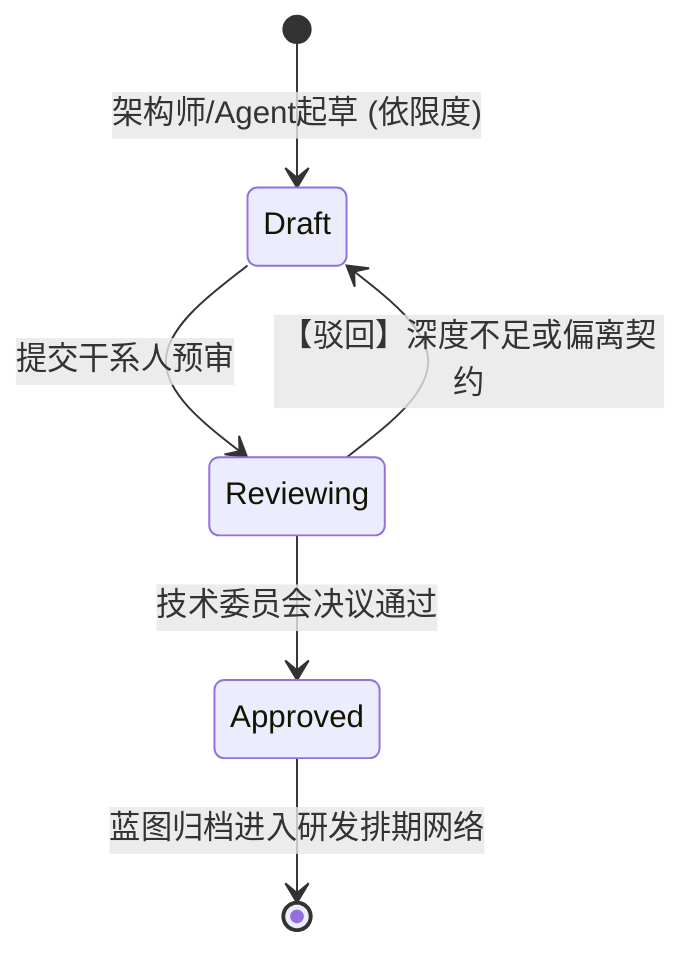

# OUT-1.3: 交付物约定与格式契约 (Deliverables Expectation & Contract)

**文档元数据**
* **主题 (Topic)**: `[客户提供的原始 Topic 名称]`
* **分析负责人 (Agent)**: `[Architect AI Agent / 或人类架构师]`
* **文档状态**: `[Draft / Confirmed]`
* **生成时间**: `[YYYY-MM-DD]`

---

## 1. 契约执行摘要 (Executive Summary)
**交付基调定调**: {用一两句话总结本次系统架构设计最终需要向干系人交付多深、多广的技术文档体系。例如：“本次只输出到 L2 级别的系统交互拓扑与核心 API 契约协议设计，完全不涉及具体的表结构 DDL 及代码级脚手架实现模板。”}

---

## 2. 交付物矩阵与深度定义表 (Deliverables Matrix & Depth Scale)
*明确“最后要拿什么清单验收”以及“设计到什么颗粒度才算合格”。在此处严禁出现“尽可能详细”等不可被验证的虚构词汇。*

| 交付物模型类型 (Deliverable Type) | 目标深度/颗粒度水位线 (Target Granularity) | 格式与产出规范 (Format & Tooling) | 核心验收干系人 (Main Reviewer) |
|-----------------------------------|--------------------------------------------|-----------------------------------|--------------------------------|
| **高层架构拓扑流图**              | `[必须支持 L2 级别，展示微服务间依赖边界与北向网关入口]` | `[.drawio + Mermaid 源码]`          | `[架构委员会 / CTO]`           |
| **领域模型与数据流向表**          | `[必须标识核心聚合根、且标明敏感数据的跨边界异地流转路线]`| `[.drawio / Markdown Table]`      | `[核心开发组长 / DBA]`         |
| **系统核心 API 契约规范**         | `[仅需覆盖 OUT-1.1 中标记为 P0 级别的核心正向交易流程]` | `[OpenAPI 3.0 YAML / Codeblock]`  | `[前后端研发联调组]`           |
| **组件选型与评估矩阵**            | `[发生争议或新引入组件时，需对比 >2 种备选方案并附带得分]`| `[Markdown MECE Matrix]`          | `[架构安全合规部]`             |
| **灾备降级与灰度演进预案**        | `[必须精确写出熔断降级开关配置节点的 Key 与数据回滚粗则]`| `[Markdown 文字与指令块]`           | `[SRE 团队 / 运维负责人]`      |

---

## 3. 协作流转与质控节点拓扑 (Collaboration & QA Topology)
*(展示：本期约定交付物的撰写、评审与归档状态流转限制)*

> 相关源文件附件指引: [`deliverable_qa_flow.drawio`](diagrams/deliverable_qa_flow.drawio)

---

## 4. 反向交付边界护城河 (Out of Scope / Anti-Goals)
*为了防止无休止的需求蔓延与期望错位导致 Agent Token 爆栈，明确标注本次架构活动中**严禁产出、绝对拒绝承担**的工作项。*

* 🚫 **绝对禁止代码级实现**: `[明确本次输出不提供任何形式的可编译源码、前端脚手架或 ORM 映射类代码，止步于设计！]`
* 🚫 **拒绝输出物理部署脚本**: `[明确不输出具体的 Terraform/K8s YAML 实体部署文件，仅提供集群容器部署拓扑示意]`
* 🚫 **抛弃极低频边缘分支设计**: `[拒绝对异常触发占比小于千分之一的边缘数据流输出详尽的防腐状态机图表]`
* 🚫 **严禁包含 UI/UX 原型交互**: `[声明本次属纯后端或底层架构拆解范畴，完全不涉及或产出任何前端高保真视觉稿与交互事件图]`

---

## 5. 【上下文流转】OUT-1.3 契约对下游设计动作的因果推证表 (Downstream Output Mapping)
*(说明本表单落槌的“交付清单和深度红线”，将如何强制指导下游 AI Agent 在推演时该花多少算力、应该在什么阶段点到为止进行死锁截断)*

| 当前 OUT-1.3 核心契约条目 | 即将命中的下游响应阶段 (Impacted Downstream Task) | 强制推证与指导指令控制流 (Enforced Reaction Logic) |
|-----------------------------|--------------------------------------------------|-------------------------------------------------------|
| **缺失 DDL 设计要求红线**   | 对应制约 `OUT-4.3 (数据模型设计)`                     | 当 Agent 推进到 4.3 阶段进行数据面拆解时，受到此约束力**强制截断深潜动作**。系统将**只生成高层 ER 实体关系矩阵，绝对禁止耗费资源去推演具体的 SQL 建表 DDL 语句片段**。 |
| **仅覆盖 P0 API 契约**      | 对应制约 `OUT-4.1 (业务 API 契约协议设计)`           | 大幅缩小 Agent 幻境流的爆炸半径。迫使其实施算力聚焦，完全无视 `OUT-1.1` 中标注的低优 P1/P2 周边接口分析，只死磕主干核心链路的数据交换。 |
| **多方案对比矩阵要求**      | 对应启发 `OUT-3.2 (多维权衡与对比分析定稿)`          | 反向激昂，强制要求下游 Agent 在处理局部难点时（如缓存选型），不能拍脑门只给一个结论，**必须强行推理出“反方候选”**，并套入打分系统严谨填表交卷。 |
| **明确验收干系人为 CTO等**  | 全局贯穿 SOP 交付口吻与视图层级                   | 控制大模型输出视角降维：得知受众为高端宏观层面，产出将严控微观琐碎实现，逼迫模型大量增加“宏观 ROI 收益、高维 RPO 数据、以及跨域服务耦合面”论述，舍弃繁杂细节。 |
