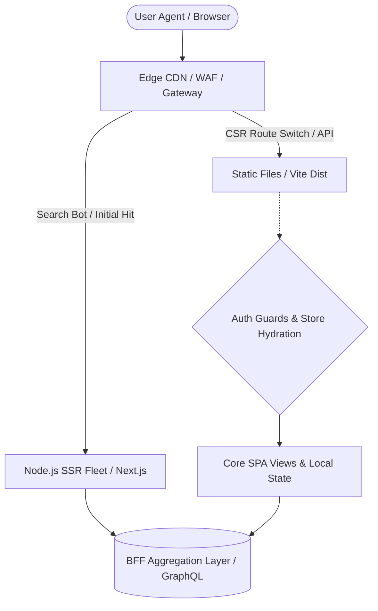

# OUT-F1.X: 前端需求定位与体验红线 (Frontend interaction Domain & NFR Baselines)

**文档元数据**
* **主题 (Topic)**: `[客户提供的原始 Topic 名称]`
* **前端架构负责人 (Agent)**: `[Frontend Architect Agent]`
* **文档状态**: `[Draft / Confirmed]`
* **生成时间**: `[YYYY-MM-DD]`

---

## 💥 0. 全局看板血脉声明 (Master Context Board Traceability)
> **这是依赖 `[EXT-Master_Context_Board.md]` 大盘看板注入与查杀的信息声明**
* [ ] **强继承声明**：本模版中关于受众画像、日均存留时长、极值性能约束及 SEO 强依赖属性等判断指标，100% 继承自全局 Master Board。
* [ ] **局域拓荒与反写声明**：由于前端的渲染约束（如首屏秒开）往往比宏观业务要求更极致，如果本阶段自行设定了极端的性能阀值和体验瓶颈倒逼策略，我将对此反向写入并更新宏观大盘的知识体系。

---

## 1. 前端架构执行摘要 (Executive Summary)
**应用心智与水域定型**: {用极其果断的语句斩断摇摆不定的全能幻想。例如：“经判断，这是一个重端侧计算并强依赖长链接的**动态交互渲染端 (Render-Heavy)**，我们将舍弃一切对于 SEO 的冗余基建支持，将研发成本全面砸向单页包体解耦、运行时主线程剥离和内存泄漏防控上。”}

---

## 2. 应用核心态势定性矩阵 (Application Paradigm MECE Matrix)
*严禁使用诸如“体验流畅”等主观词。必须通过核心驱动因子将系统从根源上定性切分。*

| 应用特征水域 (Application Paradigm) | 核心驱动因子 / 业务诉求 (Core Drivers) | 交互复杂度指征 (Interaction Complexity) | 强力主导性能指标池 (Focus Metrics) |
| :--- | :--- | :--- | :--- |
| **🔘 门户分发与内容驱动型 (Content-Heavy / SEO)** | `[填表：极高/中/无]` (如严重依赖爬虫收录引流) | 低跨页状态耦合，重文档流与内容消费 | LCP (首屏加载), CLS (防抖动), TTFB (服务端响应) |
| **🔘 深度状态流转控制台 (State-Heavy / SaaS)** | `[填表：极高/中/无]` (全站需登录认证，封闭作业环境) | 极深度联动表单、Context 跨组件流转、巨型单页渲染 | 内存管控、DOM 复用优化、Render 节流/防抖 |
| **🔘 极值高频重绘视口 (Render-Heavy / Visual)** | `[填表：极高/中/无]` (大屏/3D/协同画板/高频走势图) | Web Worker 数据剥离、WS 长链接推入、极速 Canvas 擦写 | FPS (帧率 60), INP (端侧响应耗时), 宿主 CPU 占用 |

*填表 Agent 必做：选且仅选定一个【最高优先级主导域】（例如：优先保 State-Heavy，SEO 为兼顾），如果试图既要又要，则需在此强加注释并由 CTO 或业务负责方特批资源。*

---

## 3. 前端专属 NFR：体验红线与端侧极限约束 (Quantitative UX Redlines)
*前端非功能约束核心不在于服务器扛几万 QPS，而在于极其严酷的浏览器环境配额。*

| 端侧效能指标域 (Client NFR Domain) | 绝对阈值指标 (Absolute Thresholds) | 触发降级与防御动作底层协定 (Fallback Protocol) |
| :--- | :--- | :--- |
| **首次内容加载 (LCP / FCP)** | `[如：LCP 必须 < 2.5 秒]` | `[若超出则触发骨架屏 (Skeleton) 进行全盘占位保护，剥夺白屏等待]` |
| **构建包体积红线 (JS Bundle Budget)** | `[如：核心初始 JS 无缓 gzip < 300KB]` | `[若超标将触发合并流水线构建报错；强制拆分路由懒加载及 Chunk 剥离]` |
| **设备与浏览器向下兼容 (Compat Matrix)** | `[如：最低保障至 iOS 12 Safari, Chrome 80]` | `[对不达标低端机果断注入 Polyfill 降级逻辑，剔除重体量动画及 CSS Houdini 特效]` |
| **无障碍访问底线 (a11y / WCAG)** | `[如：符合 WCAG 2.1 AA 级对比度和键盘导航能力]` | `[影响所有核心交互表单控件的基础封装验收，表单不通过 CI 拒绝合并]` |

---

## 4. 并行协同暗雷排查：依赖割裂度与 Mock 指数判定 (Cross-Team Dependency & Mock Need)
*定义前端能否在后端宕机或接口未出时，强行突围施工存活的能力。*

- **Mock 强依赖度级别判定**：`[Level 1 (弱依赖) / Level 2 (中度依赖) / Level 3 (全量强依赖)]`
- **中台联调壁垒描述**：`[说明是否存在前置数据极度复杂、需要造大量金融环境数据导致前端无法跑通视图场景的阻死风险。]`
- **对应前端反向基建挂载**：`[如果 Mock 级别达 Level 3，判定将强行引入 MSW (Mock Service Worker) 拦截本地请求层或部署 Node Mock Server 以执行强阻断隔离。]`

---

## 5. 前端应用宏观拓扑结构锚点 (Mermaid & Drawio Dual-Track)
*此章节粗描绘用户在浏览器发号施令后的宏观请求分流控制面和视图承架组网。*

> 📌 **【双模轨机制锚定】见脱水可编辑视图与网络骨架源文件：**
> 🔗 `> See: [3_final_outputs/diagrams/OUT-F1.X_Gateway_Topology.drawio]`

---

## 6. 边缘容忍阻墙与核心禁回域 (Anti-Goals / Scope Defensively Cut)
*对抗一切在业务初期的技术迷城效应和过度假想架构设计狂热。*

* 🚫 **绝对禁止深究到框架战争**：本阶段定性坚决不切入“用 Vue3 还是 React 还是 Svelte”的辩论口水战，因为在 OUT-F3.4 之前这毫无意义。
* 🚫 **绝对抵制全端一统空想**：如果应用形态被明确为内部门户，本方案当场裁定不涉及也不预留“支持未来多平台小程序 (Taro/Uniapp) 或移动端同构”的大道幻梦底层空间，直接写死为桌面/Mobile H5 最优。
* 🚫 **无视海量数据加载怪圈**：若后端不承担合理翻页，前端本期绝对不接盘类似“十万级全量表格长列表直接渲染但要求丝滑”这种无理病态需求，这是需求层面的失败，应在此处一刀斩断反驳。

---

## 7. 【流转断头台】对下游前端架构体系的命门倒逼 (Downstream Blast & Consequence Mapping)
*本轮所有的宏观定调以及对客户端苛刻的性能容忍阈值，将直接像锁链一样彻底框死后续节点的技术成色！*

| 当前水域判定 / 约束要求 | 被深度扭转受击的下游环节 | 具体锁死和倒逼的执行逻辑 (Actionable Logic) |
| :--- | :--- | :--- |
| **若敲定核心形态为【静态门户/ SEO 极度依赖】** | 💥 **倒逼** `[OUT-F3.4 渲染模式 ADR]` 与 `[OUT-F4.X Node及微服务依赖]` | 彻底毙掉纯粹的 SPA 选项，强制要求架构师向外妥协引入包含 SSR/SSG/ISR 等重型服务器端编排框架 (如 Nuxt/Next) ，前端部署也将从纯 CDN 对象存储升级为需要 K8S/Docker 守护的进程节点。 |
| **极致极微小的【包体积加载基准】**| 💥 **压轧** `[OUT-F2.X 项目排雷]` 与 `[OUT-F4.X 组件大阵规划]` | 任何超大体积的库（如 moment.js/巨型 echart 库全包）在排雷期会被列入最高警戒。4.X 架构中强权剥离组件，强制推行异步懒加载及路由边界拆封拦截策略。 |
| **若形态被重确认为【极重域 SaaS 与多层嵌套流】** | 💥 **强锁定** `[OUT-F4.X 归一化 Store 结构]` | 当场夺去散乱 Context 和组件级 State 的权力。强制倒逼使用 Zustand / Redux / Pinia ，并且极可能要求结合 Redux-Saga/RxJS 去治理复杂的时序副效应动作流转。 |
| **Mock 指数飙升至重度断层级** | 💥 **突发介入** `[OUT-F5.X 底牌及纵深防御]` | 必须立即启动 BFF 层或在网络沙盒拦截引入完整 Schema 的客户端数据中心，形成一个可以“自欺欺人”的数据造血池，否则全前端研发管线将会暴乱停滞。 |

---

## 8. 强力破冰出库网关 (Definition of Done - DoD)
> **只有毫无犹豫地勾选完这些项目，大前端管线的定性基础阶段才能被放行！任何虚浮的敷衍都应打回给发声端代理重启重发！**

- [ ] **定调铁血绝无二义**：对于“应用形态核心水域矩阵”中，是否已抛弃了面面俱到的选择，毫不留情地圈定了唯一主导地位？
- [ ] **性能指征血淋淋量化**：LCP、包体积等关键红线是否只使用了数字标尺和具体的容量单元 (KB, ms)，完全无任何模棱两可的情感判断及“待定”项？
- [ ] **拒绝被卷入战术黑洞**：在本次交付文本当中，是否从头到尾未提及最终组件底层选型细节和过度优化策略？是否完完全全保持在宏观工程水系之上？
- [ ] **大血脉追踪确认**：若本前端特有指标倒逼甚至挑战了 Master Board 之前既定的（或者太过天真的）端侧呈现理念，是否已执行联动修改，绝不让前后端存在两套平行叙事时空？
