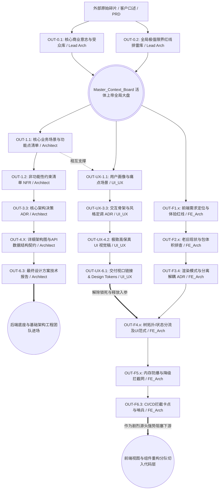

# 全局交付物依赖图谱 (Global Deliverables DAG)

> ⚠️ **项目大动脉基准盘 (Project Lifeline Pipeline)**
> 本文档定义了整个系统中，所有 Agent、所有技术职能所产生的最高级别大件输出物 (`OUT-XX.YY`) 之间的**“绝对等候与阻塞关系”**。
> 在多层并发特工网络中，谁先通车干活、谁在原地锁死等待，完全以此有向无环图 (DAG) 为全网裁决标尺。

---

## 1. 全栈工序血脉流转拓扑图 (Pipeline Topology)
*本图的本质是一棵具备生命力的动态扩张树。每在此生态接轨一个新工种（如：测试大拿、数据库架构师），织网大模型都必须在下方强行接入并发扩写它的上下游链路网络。*

---

## 2. 全局产物节点户口库 (Global Artifact Registry)
*所有跨领域流转高阶资产的总索引名录大册。它是衡量修改某一个功能点时，如何判定系统爆炸级灾变半径的最强定位雷达系统。新角色入场，务必先来此处登记户口！*

| 唯一交付 ID (Artifact) | 沉淀文档 / 纯净产物名称 | 该链条责任主理人 (Role Owner) | 强依赖死等入参 (Required Pre-Inputs) | 卡死阻塞的下游生灵 (Blocking Downstream) |
|---|---|---|---|---|
| `OUT-0.1` | 核心商业愿景及发力锚点大矩阵 | Lead Architect (定向破冰师) | `EXT 商业意图与假想需求` | 聚变压缩向：`Master_Context_Board` |
| `OUT-0.2` | NFR容灾、极值天花板及致命红线表 | Lead Architect (定向破冰师) | `OUT-0.1`, `EXT` | 同步烙印于：`Master_Context_Board` |
| **`🌟 Master Board`** | **统摄全局的项目根基点黑板长表常量池** | **(系统级多并发源点)** | **`OUT-0.1`, `OUT-0.2`** | **统御麾下：(所有专业领域特工的破冰 Phase 1)** |
| `OUT-1.1 (Arch)` | 核心业务场景与功能点细化清单 | Architect (核心架构师) | `Master_Context_Board`, `EXT` | 后置推演：`OUT-1.2 (Arch)`, 体验对齐：`OUT-UX-1.1` |
| `OUT-1.2 (Arch)` | 非功能性约束清单 (NFR List) | Architect (核心架构师) | `OUT-1.1 (Arch)`, `EXT` | 架构选型命门：`OUT-3.3 (Arch)` |
| `OUT-3.3 (Arch)` | 核心架构决策及 ADR | Architect (核心架构师) | `OUT-1.2 (Arch)`, `OUT-2.X (AS-IS现状)` | 蓝图地基：`OUT-4.X (蓝图细化)` |
| `OUT-4.X (Arch)` | 接口契约 / 库表规划 / 拓扑图 / 前端架构蓝图 | Architect (核心架构师) | `OUT-3.3 (Arch)` | 排期和最终整合：`OUT-6.3 (Arch)` |
| `OUT-6.3 (Arch)` | 原创完整版设计方案技术报告 | Architect (核心架构师) | 所有的内部设计 `OUT-1.1 ~ 6.2` | **阻塞大关：研发团队进场编写代码** |
| `OUT-UX-1.1` | 核心用户画像与关键痛点场景清单 | UI/UX Designer (体验设计师) | `Master_Context_Board`, `EXT-PRD` | UI构思的土壤：`OUT-UX-3.1` 情绪板 |
| `OUT-UX-3.3` | 主导交互结构、风格定调 ADR | UI/UX Designer (体验设计师) | `OUT-UX-3.1`, `OUT-UX-3.2 (低保真)`| 核心成图依据：`OUT-UX-4.1` 及 `OUT-UX-4.2` |
| `OUT-UX-4.2` | 核心跑通主线链路的极高保真 UI 稿 | UI/UX Designer (体验设计师) | `OUT-UX-3.3`, `OUT-UX-4.1` | 下游补齐：异常边界与动效、移交 `OUT-UX-6.1` |
| `OUT-UX-6.1` | 开发视口链接及 Design Tokens / 标注资产 | UI/UX Designer (体验设计师) | `OUT-UX-4.X`, `OUT-UX-5.X` | **受其死死卡住咽喉的下游节点：前端架构 4.X 组件大阵** |
| `OUT-F1.X` | NFR基准定音、核心交互水域定性与 Mock 判定 | Frontend Architect (前端架构管线) | `Master_Context_Board` | 倒逼压死下游：`OUT-F2.X (包体排雷)`, `OUT-F3.X` |
| `OUT-F2.X` | 依赖深渊诊断、内存泄露与渲染拓扑时长报告 | Frontend Architect (前端架构管线) | `OUT-F1.X` | 引爆决策：`OUT-F3.4 (渲染与状态 ADR)` |
| `OUT-F3.4` | 单页/SSR渲染选型、状态域(Zustand)分流 ADR | Frontend Architect (前端架构管线) | `OUT-F2.X`, `OUT-F1.2` | 底层基建依据：`OUT-F4.X (树体系规划)` |
| `OUT-F4.X` | BFF防腐契约、归一化 Store 结构与 UI 组件树 | Frontend Architect (前端架构管线) | `OUT-F3.4`, `OUT-UX-6.1` | 制约保护：`OUT-F5.X (降级与防爆)` |
| `OUT-F5.X` | OOM爆存拦截底牌、降级兜底网与 XSS 纵深层 | Frontend Architect (前端架构管线) | `OUT-F4.X` | 交付守门指标：`OUT-F6.X (流水线阈值)` |
| `OUT-F6.3` | CI/CD 性能卡点防线、错误边界哨兵集群 | Frontend Architect (前端架构管线) | 组装所有 `OUT-F1` ~ `OUT-F5` | ⚠️ **无情切断大关：前端切图仔与交互逻辑研发军团落键死等** |
