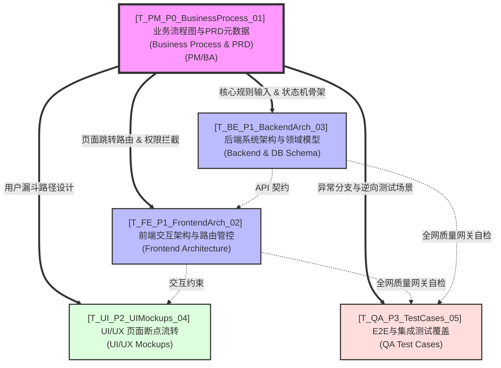

# 项目全局交付物依赖图谱与 I/O 契约管道 (Project Global I/O Pipeline)

> ⚠️ **最高指令字典 (Root Dictionary)**
> 本文档是全项目所有 Agent、角色、节点流转的 **Single Source of Truth (唯一事实基准)**。
> 任何进入执行状态的 AI Agent 或人类工程师，在开启自身任务前，**必须先查阅本表的 `必读输入依赖` 与 `下游消费者`**。没有任何实体被允许凭空制造不与上下游握手的信息孤岛。

---

## 1. 全局依赖总纲 (Global DAG Topology)
> 鸟瞰全局信息流（Data Flow）。最顶层的“业务流程图与 PRD”是向下一切基建的根系。业务的变动将顺着箭头强制触发下游的重构。

---

## 2. 全局产物节点户口库 (Global Artifact Registry)
> 此矩阵是所有子级技能 (Skill) 的“寻址路标”。当 Agent 读取了其所归属的 `Task ID` 后，必须严格按照本表的输入输出关系（I/O 契约）去 `3_final_outputs` 目录找粮，并交付自己的货物。

| 节点编号 (Task ID) | 生产者 (Role) | 核心对外交付物坐标 (Artifact URI) | 【上游】必读强制输入依赖 (Must-Have Inputs) | 【下游】核心受众与消费意图 (Consumers) |
| :--- | :--- | :--- | :--- | :--- |
| **T_PM_P0_BusinessProcess_01** | PM / BA | `3_final_outputs/OUT-0.1_Business_Process.md` | - 项目愿景宏观蓝图   - 用户原始粗口需求调研 | **全员吃粮** (T_FE_P1_FrontendArch_02, T_BE_P1_BackendArch_03, T_UI_P2_UIMockups_04, T_QA_P3_TestCases_05) |
| **T_FE_P1_FrontendArch_02** | FE Architect | `3_final_outputs/OUT-1.1_Frontend_Arch.md` | **[强依赖] `T_PM_P0_BusinessProcess_01` 业务流程图**中的“交互动作节点”与“各端漏斗流向” | 下游 **T_UI_P2_UIMockups_04** 依照此边界设计视图元件；  **T_QA_P3_TestCases_05** 据此写 Mock 脚本。 |
| **T_BE_P1_BackendArch_03** | BE Architect | `3_final_outputs/OUT-1.2_Backend_Arch.md` | **[强依赖] `T_PM_P0_BusinessProcess_01` 业务流程图**中的“数据流转换”、“外部协同 API”与“状态机变更基点” | 前端基于此开发 API 层；  下游 **T_QA_P3_TestCases_05** 构建集成测试校验通过率。 |
| **T_UI_P2_UIMockups_04** | UI/UX Designer | `3_final_outputs/diagrams/Figma_Export/` | **[强依赖] `T_PM_P0_BusinessProcess_01` 业务流程图**定义的流转逻辑（几步注册、失败退回哪），结合 `T_FE_P1_FrontendArch_02` 的前台组件库规范。 | 前端物理堆码页面的源文件；  产品经理走查。 |
| **T_QA_P3_TestCases_05** | QA Engineer | `3_final_outputs/OUT-3.1_Test_Cases.md` | **[终极强依赖] `T_PM_P0_BusinessProcess_01` 中的异常与逆向防御边界（第5章）**，并收口检验 02/03 是否满足这些防御底线。 | 全盘质量出口闸口。不通过则驳回重做。 |

---

## 3. I/O 阻断与质量门禁规范 (Strict Quality Gates)

> [!CAUTION]
> **业务流程图 (T_PM_P0_BusinessProcess_01) 防篡改铁律**
> 在系统进入架构设计期与研发期后，业务流程图作为跨部门协作的**最高“单一真相层 (Single Source of Truth) ”**，享有最高级别保护：
> 1. **代码不可凌驾于业务定义之上**：当前端、后端、UI、QA 在执行中发现逻辑断层或需求悖论时，**严禁私自通过“加代码打补丁”的方式掩盖**。
> 2. **反向阻断与变更回溯**：必须物理暂停当前任务（硬挂起），发起针对源头 `T_PM_P0_BusinessProcess_01` 的 **Change Request (CR, 变更请求)**。只有当相关图纸及矩阵更新后，其他相关方才能依据新图同步更迭，以此根绝越写越乱的“屎山”系统。

---

## 4. 数据更新与状态流转约定 (Execution Handshake Protocol)

当执行类 Agent 完成其沙盒内部推演（位于 `2_agent_workspaces/`），并将其最终结构化文档迁出至 `3_final_outputs/` 目录时，必须自动完成本次节点握手：

1. 必须根据上方的 `Artifact Registry` 找到自己下游的 `Consumers`。
2. 调用配置工具，自动改写 `context/sop/Project_Task_Registry.md` 中的看板。
3. 如果 Agent 输出了额外的附件或高保真图片，必须一并登记进入本文件的矩阵列中，不能有“暗码交易”。
