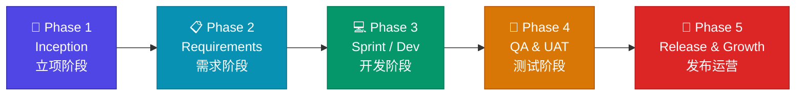
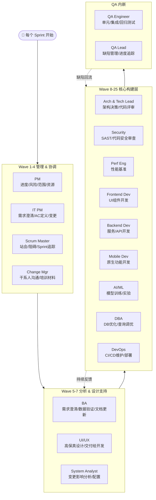
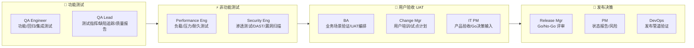
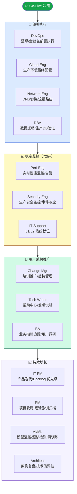

# Delivery Playbook — 流程总览图

> **使用说明**：按阶段纵向推进，每阶段内角色按 Wave（批次）横向接力。完成一个阶段的最后 Wave 后，进入下一阶段。

---

## 🏗️ 总体阶段流程

---

## 📌 Phase 1 — Inception（立项阶段）：角色接力链

Wave 内所有角色**并行**执行，完成后触发下一 Wave。

```mermaid
flowchart TD
    W1["Wave 1 — Project Manager\n📌 Charter · Stakeholders · Budget · Risk Register"]
    W2["Wave 2 — IT Product Manager\n📦 Requirements · Market Research · BRD · Feasibility"]
    W3["Wave 3 — Scrum Master\n🔄 Agile Setup · Team Formation · Tooling · DoR/DoD"]
    W4["Wave 4 — Change Manager\n🔀 Impact Assessment · Change Strategy · Sponsor Alignment"]
    W5["Wave 5 — Business Analyst\n🔍 Stakeholder ID · Business Needs · As-Is · Gap Analysis"]
    W6["Wave 6 — UI/UX Designer\n🎨 User Research · Personas · Competitive Analysis · Journey Map"]
    W7["Wave 7 — System Analyst\n🖥️ Current System Assessment · Tech Interviews · Gap & Impact"]
    W8["Wave 8 — Enterprise Architect\n🏛️ Strategic Alignment · Landscape Analysis · Principles"]
    W9["Wave 9 — Solutions Architect\n🛠️ Business-to-Tech Translation · Options Analysis · Guardrails"]
    W10["Wave 10 — IT Architect\n⚙️ Technical Discovery · Feasibility · Tech Selection · Risk ID"]
    W11["Wave 11 — Technical Lead\n💡 Technical Vision · Stack Decision · Team Assessment · Estimation"]
    W12["Wave 12 — Security Engineer\n🔐 Security Requirements · Threat Landscape · Compliance Mapping"]
    W13["Wave 13 — Performance Engineer\n⚡ Perf Requirements · Workload Profiling · Baseline Assessment"]
    W14["Wave 14 — QA Lead\n✅ Quality Strategy · Risk-Based Test Planning · Tool Selection"]
    W15["Wave 15 — QA Engineer\n🧑‍💻 Requirement Review · Risk Assessment · QA Strategy Planning"]
    W16["Wave 16 — DevOps Engineer\n🚀 Infra Assessment · Platform Selection · Environment Strategy"]
    W17["Wave 17 — Cloud Engineer\n☁️ Cloud Strategy · Platform Selection · Landing Zone · FinOps"]
    W18["Wave 18 — Network Engineer\n🌐 Network Assessment · Requirements · Architecture Planning"]
    W19["Wave 19 — Data Architect\n🗄️ Data Landscape · Strategy Alignment · Maturity Evaluation"]
    W20["Wave 20 — Data Engineer\n📊 Data Landscape · Requirements Discovery · Tech Evaluation"]
    W21["Wave 21 — DBA\n💾 DB Landscape · Platform Selection · Capacity & HA Strategy"]
    W22["Wave 22 — AI/ML Engineer\n🤖 Problem Framing · Data Availability · Feasibility Analysis"]
    W23["Wave 23 — Frontend Developer\n🖱️ Tech Feasibility · Tech Selection · Codebase Assessment"]
    W24["Wave 24 — Java Backend Developer\n☕ Feasibility Input · Tech Evaluation · Legacy Analysis"]
    W25["Wave 25 — Mobile App Developer\n📱 Platform Strategy · Tech Evaluation · Compatibility"]
    W26["Wave 26 — Technical Writer\n📝 Doc Needs · Audience Analysis · Standards · Toolchain"]
    W27["Wave 27 — Release Manager\n📦 Release Strategy · Governance · Environment Assessment"]
    W28["Wave 28 — IT Support Engineer\n🛎️ Support Readiness · Model Planning · ITSM Review"]
    W29["Wave 29 — Project Lifecycle Tasks\n📈 Business Context · Data Sources · KPI Definition\n🔚 Terminal"]

    W1 --> W2 --> W3 --> W4 --> W5 --> W6 --> W7
    W7 --> W8 --> W9 --> W10 --> W11 --> W12 --> W13
    W13 --> W14 --> W15 --> W16 --> W17 --> W18 --> W19
    W19 --> W20 --> W21 --> W22 --> W23 --> W24 --> W25
    W25 --> W26 --> W27 --> W28 --> W29

    style W1 fill:#4f46e5,color:#fff
    style W29 fill:#6b7280,color:#fff
    style W11 fill:#7c3aed,color:#fff
    style W12 fill:#b91c1c,color:#fff
    style W8 fill:#1d4ed8,color:#fff
```

---

## 📋 Phase 2 — Requirements（需求阶段）：角色责任重心

```mermaid
flowchart LR
    subgraph Management["📊 管理层 Wave 1-4"]
        PM2["PM\n项目计划/WBS/RACI"]
        IPM2["IT PM\nPRD/用户故事/优先级"]
        SM2["Scrum Master\n迭代规划/估算"]
        CM2["Change Mgr\n变更计划/培训分析"]
    end

    subgraph Analysis["🔍 分析 & 设计层 Wave 5-10"]
        BA2["Business Analyst\n需求采集/用户故事/Sign-Off"]
        UX2["UI/UX\n信息架构/原型/可用性测试"]
        SA2["System Analyst\nSRS/用例建模/接口规范"]
        EA2["Enterprise Arch\n目标架构/ARB Leadership"]
        SolA2["Solutions Arch\nSAD/集成架构/技术蓝图"]
        ITA2["IT Architect\n架构设计/NFR/集成设计"]
    end

    subgraph Tech["💻 技术 & 工程层 Wave 11-28"]
        TL2["Tech Lead\n技术设计/编码规范"]
        SE2["Security\n威胁建模/安全控制"]
        PE2["Performance\n性能测试策略/NFR规格"]
        QA2["QA Lead\n主测试计划/估算"]
        DE2["DevOps\nIaC/CI-CD设计"]
        CL2["Cloud\n云架构/IAM/IaC选型"]
        NE2["Network\n网络拓扑/安全策略"]
        DA2["Data Arch\n概念/逻辑数据建模"]
        DE_2["Data Eng\n数据架构/管道设计"]
        DBA2["DBA\n物理库设计/索引策略"]
        ML2["AI/ML\nML系统架构/实验设计"]
        FE2["Frontend\n组件架构/API规划"]
        BE2["Backend\nAPI契约/DB Schema"]
        MOB2["Mobile\n应用架构/导航设计"]
        TW2["Tech Writer\n文档结构/内容大纲"]
        RM2["Release Mgr\n发布计划/版本策略"]
        ISE2["IT Support\n支持需求/事故管理设计"]
    end

    Management --> Analysis --> Tech
```

---

## 💻 Phase 3 — Sprint / Dev（开发阶段）

---

## 🧪 Phase 4 — QA & UAT（测试阶段）

---

## 🚢 Phase 5 — Release & Growth（发布与持续增长）

---

## 📊 角色 × 阶段 责任矩阵（快速查表）

| 角色 | Phase 1 立项 | Phase 2 需求 | Phase 3 开发 | Phase 4 QA/UAT | Phase 5 发布 |
|------|-------------|-------------|-------------|---------------|-------------|
| **Project Manager** | Charter, Budget, Risk | WBS, RACI, Comms | Tracking, Risk | Go/No-Go Gate | Project Closure |
| **IT Product Manager** | BRD, Feasibility | PRD, User Stories | AC, Change Mgmt | Product Acceptance | Roadmap |
| **Scrum Master** | Team Formation | Sprint Planning | Standups, Impediments | Retrospective | Continuous Improve |
| **Change Manager** | Change Strategy | Comms Plan, Training | Training Delivery | Adoption Support | Sustain Adoption |
| **Business Analyst** | As-Is, Gap Analysis | User Stories, Sign-Off | Requirement Support | UAT Facilitation | Metrics Tracking |
| **UI/UX Designer** | Personas, Research | Wireframes, Prototypes | Hi-Fi Design, Handoff | Design QA | UX Metrics |
| **System Analyst** | Current System Audit | SRS, Use Cases | Change Impact | System Validation | — |
| **Enterprise Architect** | Landscape Analysis | Target Architecture | Governance | ARB Sign-Off | Architecture Review |
| **Solutions Architect** | Options Analysis | SAD, Integration Arch | Design Review | Architecture Compliance | Post-Deploy Review |
| **IT Architect** | Technical Discovery | Architecture Design | Code Review | NFR Validation | Prod Architecture |
| **Technical Lead** | Stack Decision | Technical Design | Mentoring, Reviews | Technical Sign-Off | Hotfix Support |
| **Security Engineer** | Threat Assessment | Threat Modeling | SAST Review | Pen Testing | Prod Security |
| **Performance Engineer** | Workload Profiling | Perf Test Strategy | Baseline Benchmark | Load/Stress Testing | Prod Monitoring |
| **QA Lead** | Quality Strategy | Master Test Plan | Test Oversight | Defect Management | Production Quality |
| **QA Engineer** | Testability Review | Test Case Design | Test Execution | Regression/UAT | Prod Verification |
| **DevOps Engineer** | Infra Assessment | IaC, CI/CD Design | Pipeline Ops | Release Validation | Prod Deployment |
| **Cloud Engineer** | Cloud Strategy | Cloud Architecture | Cloud Build | Cloud Validation | Cloud Ops |
| **Network Engineer** | Network Assessment | Network Design | Network Build | Network Validation | Prod Network Ops |
| **Data Architect** | Data Landscape | Data Modeling | Data Pipeline | Data Validation | Data Governance |
| **Data Engineer** | Tech Evaluation | Pipeline Design | Pipeline Build | Pipeline Testing | Prod Pipeline |
| **DBA** | DB Assessment | Physical DB Design | DB Optimization | DB Perf Testing | Prod DB Ops |
| **AI/ML Engineer** | Problem Framing | ML Architecture | Model Training | Model Validation | Model Monitoring |
| **Frontend Developer** | Tech Feasibility | Component Architecture | UI Feature Dev | UI Testing | Prod Support |
| **Java Backend Developer** | Feasibility Input | API Contracts | Service Dev | Integration Testing | Prod Support |
| **Mobile App Developer** | Platform Strategy | App Architecture | Native Feature Dev | Mobile Testing | App Store Release |
| **Technical Writer** | Doc Needs Assessment | Doc Structure | Draft Content | Doc Review | Help Center |
| **Release Manager** | Release Strategy | Release Plan | Pipeline Setup | Go/No-Go Decision | Release Execution |
| **IT Support Engineer** | Support Readiness | Support Requirements | Knowledge Base | Support Trial | L1/L2 Live Support |
