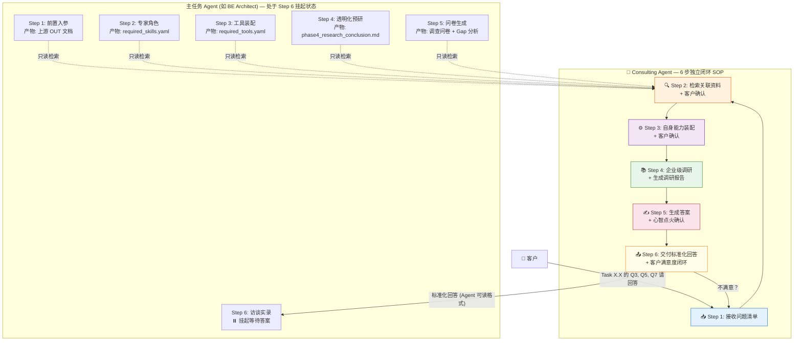
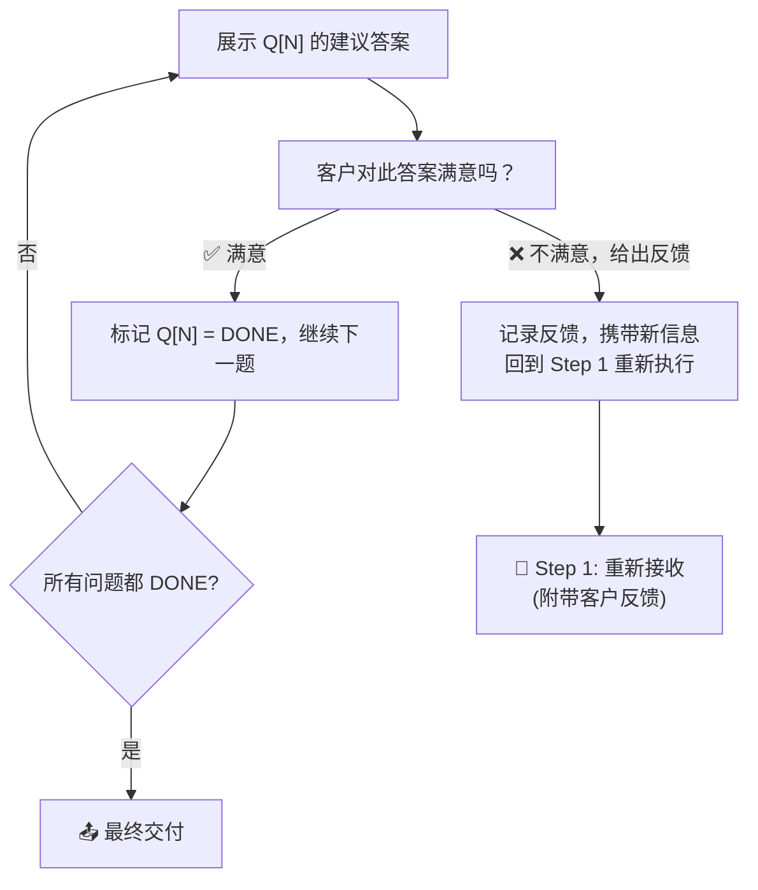

# Consulting AI Agent Skill — 概念计划 (v2.0)

## 痛点分析

在 9 步 SOP 工作流中，**Step 5 (沉浸式问卷对齐)** 会动态生成一份高水准的数据调查问卷，然后 **Step 6 (访谈实录)** 要求 Agent 与客户基于此问卷深度交流。

**现实问题**：客户常常面对以下困境：
- 问题太专业（如："您的系统 RPO 容忍值是多少？"），客户不理解含义
- 问题需要背景知识（如："您期望的分布式锁粒度？"），客户缺乏技术储备  
- 客户不清楚行业最佳实践，无法给出合理的回答
- 客户干脆跳过不回答，导致信息差无法填平

**后果**：Step 5 计算出的 Gap 无法在 Step 6 中闭合 → Step 8 DoD 质量门禁不通过 → 交付物驳回重做

---

## 解决方案：Consulting Skill (问卷咨询顾问)

### 核心定位

一个**独立于主任务 Agent 的辅助型 Skill**。它不执行 9 步 SOP，不产出 OUT 文档。它唯一的职责是：**帮助客户理解并回答问卷中的问题**，最终目标是输出一份**被咨询的 AI Agent 能直接理解并吸收的标准化回答**。

### 触发场景

客户在 Step 6 访谈中遇到不会回答的问题 → 告诉 Consulting Agent："Task X.X 的问题 Q3、Q5、Q7 请回答" → Consulting Agent 启动

### 全局流程鸟瞰图



---

## Consulting Agent 6 步闭环 SOP (The 6-Step Consulting Workflow)

### Step 1: 📥 接收问题清单与任务定位 (Intake & Task Binding)

**触发输入**：客户发送形如 `"Task X.X 的问题 Q3、Q5、Q7 请回答"` 的指令。

**Agent 必须执行的动作**：
1. **解析目标任务 ID**：从客户指令中提取被咨询任务的 Task ID（如 `T_BE_P1_BackendArch_03`）
2. **解析问题编号**：提取需要回答的具体问题编号列表（如 Q3, Q5, Q7）
3. **定位任务工作区**：根据 Task ID 定位到 `2_agent_workspaces/[被咨询任务文件夹]/` 目录
4. **确认清单**：向客户复述："我将为 Task [ID] 的以下问题提供建议答案：[Q3: 原文], [Q5: 原文], [Q7: 原文]。确认无误？"

**产出物**：无物理文件，仅对话流确认。

**拦截点**：客户确认问题清单无误后方可进入 Step 2。

---

### Step 2: 🔍 检索被咨询任务的关联资料 (Context Retrieval & Source Declaration)

**目标**：从被咨询任务的 Step 1-5 产物中，精准检索出与每个问题相关的上下文段落。

**Agent 必须读取的产物矩阵**：

| 来源 Step | 产物路径 | 检索目的 |
| :--- | :--- | :--- |
| **Step 1 产物** | 上游 OUT 文档 (如 `3_final_outputs/OUT-0.1_Business_Process.md`) + `Master_Context_Board.md` | 理解业务背景、项目约束、前置决策 |
| **Step 2 产物** | `2_agent_workspaces/[task]/config/required_skills.yaml` | 了解主 Agent 的专家角色视角 |
| **Step 3 产物** | `2_agent_workspaces/[task]/config/required_tools.yaml` | 了解技术边界与权限约束 |
| **Step 4 产物** | `2_agent_workspaces/[task]/phases/phase4_research_conclusion.md` + `phase4_research_trace.md` | 获取行业调研结论与溯源 |
| **Step 5 产物** | 问卷全文 + Gap 分析 | 理解每个问题的上下文：为何问此问题、模版要求什么、信息差在哪 |

**Agent 必须执行的动作**：
1. 逐一读取上述产物
2. 针对每个待回答的问题，**摘录出相关的段落/数据点**
3. 向客户透明汇报：

```
▶ [Step 2 资料检索完成]
Q3: [问题原文]
  → 我将参考以下资料回答此问题：
    - OUT-0.1 §3 节点数据矩阵中关于 [XXX] 的定义
    - phase4_research_conclusion.md 中关于 [XXX] 的行业调研
    - required_skills.yaml 中定义的 [XXX] 专家视角

Q5: [问题原文]
  → 我将参考以下资料回答此问题：
    - [...]

您确认我采用以上资料来回答这些问题吗？如需补充或删减请告知。
```

**拦截点**：🛑 **物理硬锁** — 客户确认资料范围后方可进入 Step 3。

---

### Step 3: ⚙️ 自身能力装配 (Self Capability Assembly)

**目标**：Consulting Agent 为自己规划回答这些问题所需的专家角色、工具和调研方向。与主任务 Agent 的 Step 2/3 类似，但服务于"回答问题"这一具体目标。

**Agent 必须执行的动作**：
1. **推导专家角色**：为了回答这些问题，我必须扮演什么级别的专家？需要什么专精技能与行业经验？
2. **推导所需工具**：需要哪些检索/分析工具？设定 `forbidden_tools` 黑名单（严禁修改主 Agent 任何产物）
3. **规划调研清单**：列出为了回答这些问题，还需要额外调研哪些内容

**产出物** — 存放至 `2_agent_workspaces/[task]/consulting/`：

| 文件 | 说明 |
| :--- | :--- |
| `consulting_skills.yaml` | Consulting Agent 的专家角色与技能配置 |
| `consulting_tools.yaml` | 工具白名单 + 黑名单 |
| `consulting_research_plan.md` | 待调研内容清单与检索策略 |

**向客户透明汇报**：

```
▶ [Step 3 能力装配完成]
- 我将以 [高级后端架构顾问 + 企业级分布式系统专家] 的角色回答问题
- 我将使用的工具: [web_search, read_file] | 禁用: [run_command, write_to_file(主Agent产物)]
- 我还需要额外调研: [1. XXX 方向 2. YYY 方向 3. ZZZ 方向]
您同意后我将开始调研。
```

**拦截点**：🛑 **物理硬锁** — 客户确认后方可进入 Step 4。

---

### Step 4: 📚 企业级深度调研 (Enterprise-Grade Research)

**目标**：针对 Step 3 规划的调研清单，进行高标准检索。

**🚨 调研红线 (Red Lines)**：
- ✅ 必须是**企业级**内容（大厂技术博客、RFC 标准、云厂商白皮书）
- ✅ 必须是**专业的**（来自领域权威机构、知名工程师）
- ✅ 必须是**权威的**（有明确出处、可溯源）
- ✅ 必须是**最新的**（优先近 2 年的内容，明确标注发布时间）
- ❌ 严禁内容农场、过时博客、无出处的二手信息
- ❌ 严禁仅凭自身训练数据作答而不做实时检索

**Agent 必须执行的动作**：
1. 按 `consulting_research_plan.md` 规划的方向逐一执行检索
2. 对每条检索结果评估：来源可信度、时效性、与问题的相关度
3. 生成调研报告

**产出物** — 存放至 `2_agent_workspaces/[task]/consulting/`：

| 文件 | 说明 |
| :--- | :--- |
| `consulting_research_report.md` | 调研报告：包含调研思路、检索过程、每条结论及其出处、应用方向 |
| `consulting_research_trace.md` | 调研溯源日志：搜索了哪些 URL、为何采纳/抛弃某结果 |

**无拦截点**：调研完成后直接进入 Step 5（因为调研计划已在 Step 3 获批）。

---

### Step 5: ✍️ 生成答案 — 含强制心智点火 (Answer Generation with Mindset Ignition)

**目标**：综合 Step 2 检索的任务上下文 + Step 4 调研的行业知识，生成每个问题的建议答案。

**🚨 强制心智点火 (Mindset Ignition Check)**：
在生成任何答案之前，Agent 必须在输出流中**强制打印**以下确认日志：

```
▶ [Step 5 心智点火确认]
- 我当前扮演的角色: [读取 consulting_skills.yaml]
- 我拥有的技能: [列出]
- 我使用的工具: [读取 consulting_tools.yaml]
- 我将采用的资料:
  · 任务上下文资料 (Step 2): [列出摘录的段落引用]
  · 调研资料 (Step 4): [列出 consulting_research_report.md 中的结论引用]
- 本步目标: 为 Q[N] 生成企业级建议答案
- 确认以上资料已全部加载并将被运用于答案生成 ✅
```

**输出格式 (Per Question)**：

```markdown
---
## Q[N]: [原始问题全文]

### 1. 问题解析 (What is this question about?)
> 通俗语言解释这个问题在问什么，为什么主 Agent 需要知道这个信息。
> 说明这个问题在模版中对应的必填数据项。

### 2. 关键考量因素 (Key Factors to Consider)
- **业务维度**: [...]
- **技术维度**: [...]
- **成本维度**: [...]
- **合规/安全维度**: [...]

### 3. 解决思路 (Solution Approach)
- **方案 A (保守型)**: [...] | Trade-off: [...]
- **方案 B (平衡型)**: [...] ← 推荐 | Trade-off: [...]
- **方案 C (激进型)**: [...] | Trade-off: [...]

### 4. 企业级专业建议 (Professional Recommendation)
- **推荐答案**: [具体、可直接采纳的答案文本]
- **推荐理由**: [引用 Step 4 调研报告中的权威依据]
- **参考标杆**: [行业头部企业的做法 + 出处链接]
- **风险提示**: [采纳此答案后的下游影响]

### 5. 📋 Agent 可读回答 (Standardized Answer for AI Agent)
> **以下内容可直接粘贴给被咨询的 AI Agent 作为 Step 6 访谈回答：**
```
关于 Q[N] "[问题原文]" 的回答：
[直接、简洁、结构化的答案文本，使用被咨询 Agent 的专业术语]
依据：[简要引用来源]
补充约束：[如果有特殊前提条件或限制]
```
---
```

**产出物** — 存放至 `2_agent_workspaces/[task]/consulting/`：

| 文件 | 说明 |
| :--- | :--- |
| `consulting_suggested_answers.md` | 完整建议答案报告（含全部问题） |

---

### Step 6: 📤 交付与满意度闭环 (Delivery & Satisfaction Loop)

**目标**：将生成的答案呈现给客户，确认满意后交付。

**Agent 必须执行的动作**：
1. 向客户逐题展示答案（包含"Agent 可读回答"部分）
2. 明确询问客户对每个答案的满意度

**客户反馈处理**：



**最终交付物格式**：

客户确认所有答案后，Consulting Agent 生成最终的**标准化回答汇总**，格式专为被咨询的 AI Agent 设计：

```markdown
# Consulting 建议答案汇总 — Task [ID]
> 生成时间: [YYYY-MM-DD HH:MM]
> 咨询问题: Q3, Q5, Q7
> 状态: 客户已确认

## Q3: [问题原文]
**回答**: [标准化答案]
**依据**: [来源]
**约束**: [前提条件]

## Q5: [问题原文]
**回答**: [标准化答案]
**依据**: [来源]
**约束**: [前提条件]

## Q7: [问题原文]
**回答**: [标准化答案]
**依据**: [来源]
**约束**: [前提条件]
```

> ⚠️ 客户将此汇总**粘贴给被咨询的 AI Agent**，Agent 即可将其作为 Step 6 访谈的正式回答继续执行后续流程。

---

## 产出物汇总与存放

| 文件 | 路径 | 生成步骤 | 说明 |
| :--- | :--- | :--- | :--- |
| `consulting_skills.yaml` | `2_agent_workspaces/[task]/consulting/` | Step 3 | Consulting Agent 的角色与技能配置 |
| `consulting_tools.yaml` | `2_agent_workspaces/[task]/consulting/` | Step 3 | 工具白名单 + 黑名单 |
| `consulting_research_plan.md` | `2_agent_workspaces/[task]/consulting/` | Step 3 | 调研方向与检索策略 |
| `consulting_research_report.md` | `2_agent_workspaces/[task]/consulting/` | Step 4 | 调研结论、出处、应用方向 |
| `consulting_research_trace.md` | `2_agent_workspaces/[task]/consulting/` | Step 4 | 调研溯源日志 |
| `consulting_suggested_answers.md` | `2_agent_workspaces/[task]/consulting/` | Step 5 | 完整建议答案报告 |

> ⚠️ 所有产出物存放在被咨询任务的**私有沙盒子目录** `consulting/` 下，不进 `3_final_outputs/`。

---

## Anti-Goals (防越界声明)

| 编号 | 绝对禁止事项 |
| :--- | :--- |
| **AG-01** | 严禁替客户做最终决策 — 只提供建议，决策权归客户 |
| **AG-02** | 严禁修改被咨询任务的任何已有产物（OUT 文档、yaml 配置、调研底稿等） |
| **AG-03** | 严禁产出 OUT 正式文档 — Consulting Agent 不是生产者 |
| **AG-04** | 严禁跳过客户确认拦截点 — Step 2、Step 3 必须获批后才能继续 |
| **AG-05** | 严禁使用低质量信息源 — 红线不可逾越 |

---

## Proposed Changes

### Component 1: Consulting Skill Prompt

#### [NEW] [Prompt_for_Consulting_Skill.md](file:///Users/allenwang/build/ai/workspace/kareem/docs/prompt/Prompt_for_Consulting_Skill.md)

独立的 Consulting Skill Prompt，包含完整的 6 步闭环 SOP、Anti-Goals、产出物规范、心智点火机制。

### Component 2: Meta-Prompt 更新  

#### [MODIFY] [Prompt_for_Generating_Skill_Prompts.md](file:///Users/allenwang/build/ai/workspace/kareem/docs/prompt/Prompt_for_Generating_Skill_Prompts.md)

在 Step 5-6 之间增加 Consulting Skill 触发说明。

---

## Verification Plan

### Automated Tests
- 验证 Prompt 文件创建且 6 步 SOP 完整
- 验证 Anti-Goals 全部声明
- 验证所有产出物路径指向 `consulting/` 子目录
- 验证心智点火确认日志格式

### Manual Verification
- 用 OUT-1.2 模版的一个实际问卷样本触发 Consulting Agent，验证 6 步闭环执行
- 验证最终标准化回答可被主 Agent 直接理解
