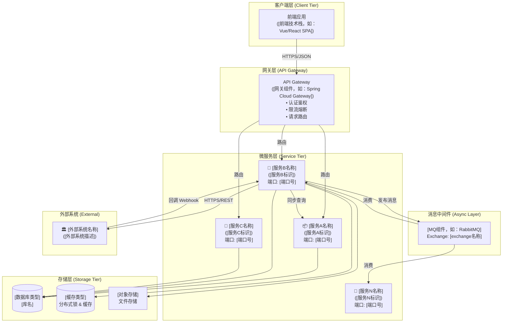
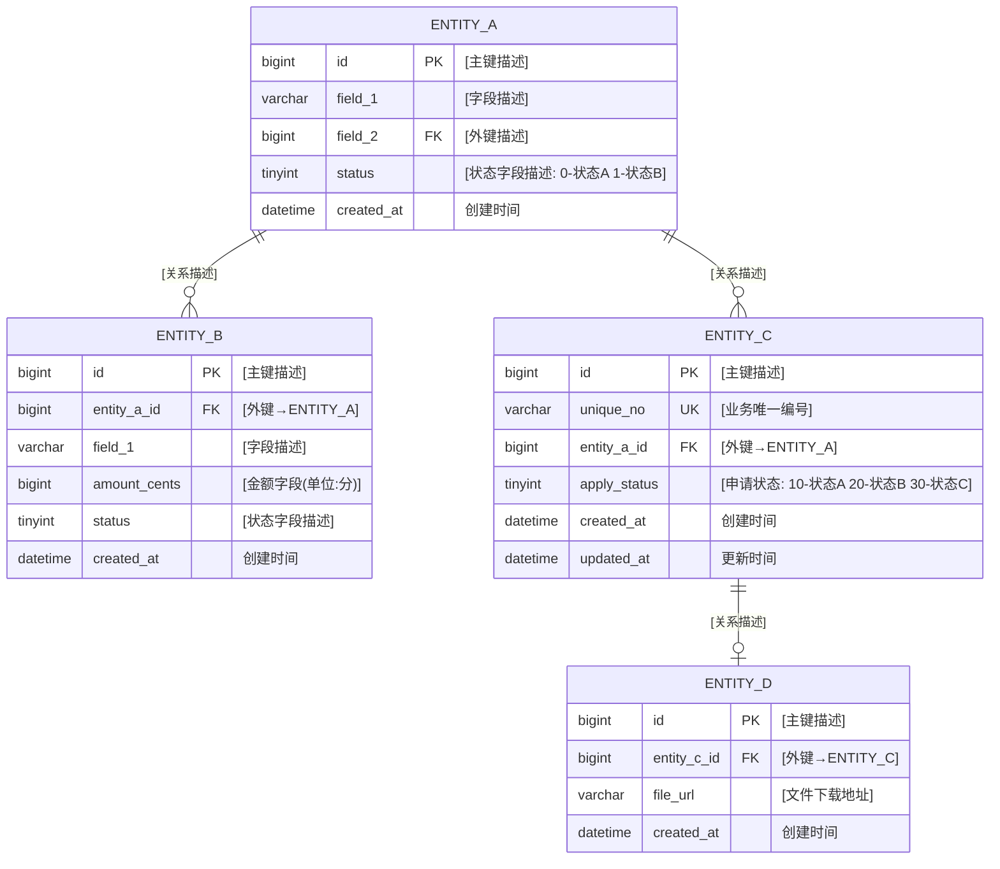
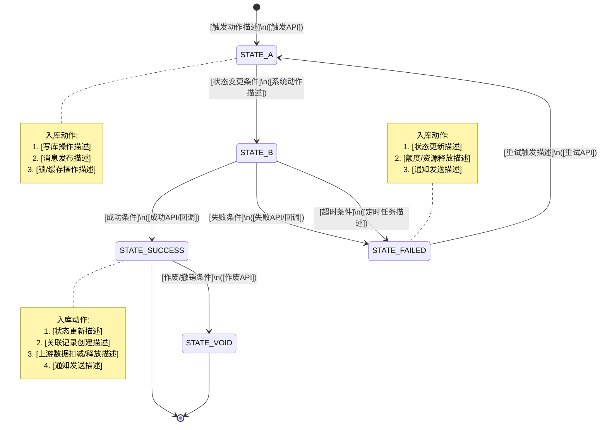

# OUT-1.2: 后端系统架构与领域模型 (Backend Architecture & Domain Model)

> ⚠️ **模版使用说明**
> 本文档是 `T_BE_P1_BackendArch_03` 任务的标准交付物模版，由 **BE Architect (后端架构师)** 负责填写。
> 填写完成后的成品文档必须输出至 `3_final_outputs/OUT-1.2_Backend_Arch.md`。
> 所有 `[占位符]` 必须被替换为实际内容，严禁残留空白占位符。
> **核心定位**：后端开发工程师拿到此文档后，应能**直接开始编码**，无需再追问架构师。

---

## 文档元数据 (Document Metadata)

| 属性 | 内容 |
| :--- | :--- |
| **文档编号** | OUT-1.2 |
| **Task ID** | `T_BE_P1_BackendArch_03` |
| **生产者角色** | BE Architect (后端架构师) |
| **业务流程来源** | `OUT-0.1_Business_Process.md` — `[关联的业务流程编号，如：BP-FIN-001]` |
| **文档状态** | `[Draft / Under Review / Confirmed]` |
| **版本** | `v[X.Y]` |
| **生成时间** | `[YYYY-MM-DD]` |
| **技术栈** | `[语言/框架 + 数据库 + 缓存 + 消息队列，如：Java 21 / Spring Boot 3.x / MySQL 8.x / Redis 7.x / RabbitMQ 3.x]` |

### I/O 依赖声明 (Dependency Contract)

> 本表声明本文档与上下游交付物的精确关联。填写时必须核对 `Project_Global_IO_Pipeline_Template.md` 中的 Artifact Registry。

| 方向 | Task ID | 交付物路径 (Artifact URI) | 关联说明 |
| :--- | :--- | :--- | :--- |
| **⬆️ 上游输入** | `T_PM_P0_BusinessProcess_01` | `3_final_outputs/OUT-0.1_Business_Process.md` | 业务流程图中的数据流转换、外部协同 API 与状态机变更基点 |
| **➡️ 平级关联** | `T_FE_P1_FrontendArch_02` | `3_final_outputs/OUT-1.1_Frontend_Arch.md` | 本文档 §5 API 契约 → 前端 API 层调用依据 |
| **➡️ 平级关联** | `T_UI_P2_UIMockups_04` | `3_final_outputs/diagrams/Figma_Export/` | 本文档 §3 Schema 字段 → UI 表单字段展示依据 |
| **⬇️ 下游消费** | `T_QA_P3_TestCases_05` | `3_final_outputs/OUT-3.1_Test_Cases.md` | 本文档 §5 API + §7 错误码 → 集成测试用例构建 |

---

## 1. 系统架构总览 (System Architecture Overview)

> 面向【架构师】、【后端开发】。
> 定义本业务流程涉及的服务边界、通信协议与基础组件。开发人员据此理解系统全局拓扑。
> 【强制双轨制图】：必须在文档中使用 Mermaid 语法渲染，且必须同步生成对应的 `.drawio` 独立绘图文件。

### 1.1 服务拓扑图



> 📎 独立图纸文件：`diagrams/backend_service_topology.drawio`

### 1.2 技术选型与约束

| 技术组件 | 选型 | 版本 | 用途 |
| :--- | :--- | :--- | :--- |
| **语言 & 框架** | `[如：Java + Spring Boot]` | `[如：JDK 21 + Spring Boot 3.2]` | 主业务服务 |
| **数据库** | `[如：MySQL]` | `[如：8.0+]` | 业务主库 |
| **缓存** | `[如：Redis]` | `[如：7.x]` | 分布式锁、热数据缓存 |
| **消息队列** | `[如：RabbitMQ]` | `[如：3.12+]` | 异步任务通信 |
| **对象存储** | `[如：阿里云 OSS / AWS S3]` | `-` | `[用途描述]` |
| **API 网关** | `[如：Spring Cloud Gateway]` | `[版本]` | 统一入口、限流、鉴权 |
| **注册中心** | `[如：Nacos / Consul]` | `[版本]` | 服务发现 & 配置中心 |

### 1.3 关键设计约束

> ⚠️ 约束来源必须追溯到 OUT-0.1 中的异常场景编号或架构强制规范。

| 约束编号 | 约束描述 | 来源 (溯源 OUT-0.1) |
| :--- | :--- | :--- |
| **C-01** | `[约束描述，如：所有金额以分(cent)为单位进行整数运算，严禁浮点运算]` | `OUT-0.1 E-[XX]` |
| **C-02** | `[约束描述，如：同一笔业务对象同一时刻只允许一笔有效操作申请(分布式锁)]` | `OUT-0.1 E-[XX]` |
| **C-03** | `[约束描述，如：第三方API超时X秒，重试N次，间隔M分钟]` | `OUT-0.1 E-[XX]` |
| **C-04** | `[约束描述，如：所有外部回调接口必须实现幂等性]` | 架构强制规范 |

---

## 2. 领域模型 (Domain Model)

> 面向【后端开发】、【DBA】。
> 定义核心业务实体及其关系。直接源自 OUT-0.1 §3 节点数据矩阵中识别到的领域对象。
> **前端关联 (→ T_FE_P1_FrontendArch_02)**：本章实体的字段集合限定了前端可展示的数据边界。
> **UI/UX 关联 (→ T_UI_P2_UIMockups_04)**：实体字段直接约束 UI 表单项设计。

### 2.1 ER 关系图



> 📎 独立图纸文件：`diagrams/backend_er_diagram.drawio`

### 2.2 聚合根与服务边界划分

> 根据 DDD 战术设计，将实体分组到聚合根下，并映射到对应的微服务。

| 聚合根 (Aggregate Root) | 包含实体 | 归属服务 | 说明 |
| :--- | :--- | :--- | :--- |
| **[聚合根A]** | `[Entity1, Entity2]` | `[service-a]` | `[聚合根A的职责描述]` |
| **[聚合根B]** | `[Entity3, Entity4]` | `[service-b]` | `[聚合根B的职责描述]` |
| **[聚合根C]** | `[Entity5, Entity6]` | `[service-c]` | `[聚合根C的职责描述]` |

---

## 3. 数据库 Schema (DDL)

> 面向【后端开发】、【DBA】。
> 🔧 **开发人员指南**：以下 DDL 可直接在目标数据库环境执行。所有金额字段使用 `BIGINT` 存储**最小货币单位 (如：分)** 的整数值。
> **UI/UX 关联 (→ T_UI_P2_UIMockups_04)**：表字段定义了 UI 表单可展示的数据范围，UI 设计不可展示 Schema 中不存在的字段。

### 3.1 [服务A] 相关表

```sql
-- ============================================================
-- [表名描述]
-- 归属服务: [service-name]
-- 关联前端: [对应的前端页面/组件描述]
-- ============================================================
CREATE TABLE `t_[表名]` (
    `id`             BIGINT       NOT NULL AUTO_INCREMENT COMMENT '[主键描述] (PK)',
    `[字段名]`       VARCHAR(32)  NOT NULL                COMMENT '[字段描述]',
    `[外键字段]`     BIGINT       NOT NULL                COMMENT '[外键描述] (FK -> [关联服务])',
    `[金额字段]`     BIGINT       NOT NULL DEFAULT 0      COMMENT '[金额描述] (单位:[最小货币单位])',
    `[状态字段]`     TINYINT      NOT NULL DEFAULT [默认值] COMMENT '[状态描述]: [值]-[含义] [值]-[含义]',
    `created_at`     DATETIME     NOT NULL DEFAULT CURRENT_TIMESTAMP COMMENT '创建时间',
    `updated_at`     DATETIME     NOT NULL DEFAULT CURRENT_TIMESTAMP ON UPDATE CURRENT_TIMESTAMP COMMENT '更新时间',
    PRIMARY KEY (`id`),
    UNIQUE KEY `uk_[唯一索引名]` (`[唯一字段]`),
    KEY `idx_[索引名]` (`[索引字段1]`, `[索引字段2]`)
) ENGINE=InnoDB DEFAULT CHARSET=utf8mb4 COLLATE=utf8mb4_unicode_ci COMMENT='[表中文注释]';
```

### 3.2 [服务B] 相关表

```sql
-- ============================================================
-- [表名描述]
-- 归属服务: [service-name]
-- 关联前端: [对应的前端页面/组件描述]
-- ============================================================
CREATE TABLE `t_[表名]` (
    `id`              BIGINT       NOT NULL AUTO_INCREMENT COMMENT '[主键描述] (PK)',
    `[业务唯一号]`    VARCHAR(32)  NOT NULL                COMMENT '[唯一编号描述] ([编号规则，如：XXX-yyyyMMdd-xxxxx])',
    `[用户外键]`      BIGINT       NOT NULL                COMMENT '[关联用户描述]',
    `[金额字段]`      BIGINT       NOT NULL DEFAULT 0      COMMENT '[金额描述] (单位:[最小货币单位])',
    `[状态字段]`      TINYINT      NOT NULL DEFAULT [默认值] COMMENT '[状态描述]: [值]-[含义]([英文]) [值]-[含义]([英文])',
    `[第三方凭证]`    VARCHAR(128)          DEFAULT NULL    COMMENT '[第三方系统凭证描述]',
    `retry_count`     TINYINT      NOT NULL DEFAULT 0      COMMENT '已重试次数 (上限[N])',
    `next_retry_at`   DATETIME              DEFAULT NULL   COMMENT '下次重试时间',
    `fail_reason`     VARCHAR(512)          DEFAULT NULL   COMMENT '失败原因',
    `[关联ID列表]`    JSON         NOT NULL                COMMENT '[关联对象描述] (JSON Array)',
    `created_at`      DATETIME     NOT NULL DEFAULT CURRENT_TIMESTAMP COMMENT '创建时间',
    `updated_at`      DATETIME     NOT NULL DEFAULT CURRENT_TIMESTAMP ON UPDATE CURRENT_TIMESTAMP COMMENT '更新时间',
    PRIMARY KEY (`id`),
    UNIQUE KEY `uk_[唯一索引名]` (`[唯一字段]`),
    KEY `idx_[复合索引名]` (`[字段1]`, `[字段2]`),
    KEY `idx_[状态重试索引]` (`[状态字段]`, `next_retry_at`)
) ENGINE=InnoDB DEFAULT CHARSET=utf8mb4 COLLATE=utf8mb4_unicode_ci COMMENT='[表中文注释]';

-- [附属记录表：如操作成功后生成的记录]
CREATE TABLE `t_[附属记录表名]` (
    `id`              BIGINT       NOT NULL AUTO_INCREMENT COMMENT '[记录ID] (PK)',
    `[主表外键]`      BIGINT       NOT NULL                COMMENT '[关联主表描述] (FK)',
    `[业务编号字段]`  VARCHAR(32)  NOT NULL                COMMENT '[业务编号描述]',
    `[文件URL字段]`   VARCHAR(512)          DEFAULT NULL   COMMENT '[文件下载地址描述]',
    `[日期字段]`      DATE         NOT NULL                COMMENT '[业务日期描述]',
    `created_at`      DATETIME     NOT NULL DEFAULT CURRENT_TIMESTAMP COMMENT '创建时间',
    PRIMARY KEY (`id`),
    UNIQUE KEY `uk_[唯一外键]` (`[主表外键]`),
    KEY `idx_[业务编号]` (`[业务编号字段]`)
) ENGINE=InnoDB DEFAULT CHARSET=utf8mb4 COLLATE=utf8mb4_unicode_ci COMMENT='[表中文注释]';
```

> ⚠️ **索引设计原则**：
> 1. 所有外键字段必须建索引
> 2. 高频查询条件组合建复合索引（遵循最左前缀原则）
> 3. 状态+时间类字段组合索引用于定时任务扫描

---

## 4. 状态机设计 (State Machine)

> 面向【后端开发】。
> 定义核心业务对象的完整生命周期状态流转。直接源自 OUT-0.1 §3 中的状态机变更定义。
> **前端关联 (→ T_FE_P1_FrontendArch_02)**：前端列表页需按此状态枚举渲染标签颜色与文案。
> **UI/UX 关联 (→ T_UI_P2_UIMockups_04)**：设计师需为每种状态设计对应的视觉样式（颜色、图标）。

### 4.1 核心状态流转图



> 📎 独立图纸文件：`diagrams/[业务对象]_state_machine.drawio`

### 4.2 状态枚举定义

> 🎨 `color` 字段供 `T_UI_P2_UIMockups_04` 参考视觉设计；`label` 字段供 `T_FE_P1_FrontendArch_02` 渲染列表标签。

```java
/**
 * [业务对象名称] 状态枚举
 * 面向前端: 前端据此渲染列表状态标签
 * 面向UI/UX: 设计师据此设计各状态对应的颜色和图标
 */
public enum [EntityName]Status {

    STATE_A([code], "[中文标签]", "[Tooltip描述]", "[色值，如：#1890FF]"),   // [颜色名]
    STATE_B([code], "[中文标签]", "[Tooltip描述]", "[色值，如：#FAAD14]"),   // [颜色名]
    STATE_SUCCESS([code], "[中文标签]", "[Tooltip描述]", "[色值，如：#52C41A]"), // [颜色名]
    STATE_FAILED([code], "[中文标签]", "[Tooltip描述]", "[色值，如：#FF4D4F]"),  // [颜色名]
    STATE_VOID([code], "[中文标签]", "[Tooltip描述]", "[色值，如：#999999]");    // [颜色名]

    private final int code;
    private final String label;       // 前端展示文案
    private final String description; // Tooltip 描述
    private final String color;       // UI/UX 推荐色值

    // constructor, getters ...
}
```

---

## 5. API 契约 (RESTful API Contract)

> 面向【后端开发】、**【前端开发】**。
> 🔧 **前端开发指南 (→ T_FE_P1_FrontendArch_02)**：本节 API 契约是前端服务调用的**唯一依据**。前端可据此直接编写 Mock 和接口层代码。
> 🎨 **UI/UX 关联 (→ T_UI_P2_UIMockups_04)**：每个 API 的 Response 字段集合限定了页面可展示的数据范围。

### 5.1 接口总览

| # | Method | Path | 描述 | 来源 (OUT-0.1 步骤) |
| :--- | :--- | :--- | :--- | :--- |
| 1 | `GET` | `/api/v1/[资源]/[操作]` | `[接口描述]` | 步骤 [N]: `[步骤名]` |
| 2 | `POST` | `/api/v1/[资源]/[操作]` | `[接口描述]` | 步骤 [N]: `[步骤名]` |
| 3 | `GET` | `/api/v1/[资源]` | `[接口描述]` | 步骤 [N]: `[步骤名]` |
| 4 | `POST` | `/api/v1/[资源]/[操作]` | `[接口描述]` | 步骤 [N]: `[步骤名]` |
| 5 | `GET` | `/api/v1/[资源]` | `[接口描述]` | 步骤 [N]: `[步骤名]` |
| 6 | `GET` | `/api/v1/[资源]/{id}` | `[接口描述]` | 步骤 [N]: `[步骤名]` |
| 7 | `PUT` | `/api/v1/[资源]/{id}/[操作]` | `[接口描述]` | `[触发条件]` |
| 8 | `POST` | `/api/v1/[资源]/callback` | `[内部回调接口]` | 步骤 [N]: `[步骤名]` |
| 9 | `GET` | `/api/v1/[资源]/{id}/download` | `[文件下载]` | 步骤 [N]: `[步骤名]` |

### 5.2 接口详细定义

> ⚠️ 以下模版需为 **每一个 API** 重复填写。每个接口必须完整定义请求/响应结构，前端据此直接开发。

---

#### API-[N]: [接口描述]

> 对应 OUT-0.1 步骤 [N]：`[步骤描述引用]`
> ⚠️ [特殊约束说明，如：并发防护、幂等要求等]

```
[METHOD] /api/v1/[resource]/[action]
```

**请求头 (Headers)**

| Header | 说明 |
| :--- | :--- |
| `Authorization` | `Bearer {access_token}` |
| `Content-Type` | `application/json` |

**请求参数 (Query / Body)**

| 参数名 | 类型 | 必填 | 说明 | 校验规则 |
| :--- | :--- | :--- | :--- | :--- |
| `[参数1]` | `[类型]` | `[是/否]` | `[参数描述]` | `[校验逻辑，如：最大50个元素]` |
| `[参数2]` | `[类型]` | `[是/否]` | `[参数描述]` | `[校验逻辑]` |
| `page` | `int` | 否 | 页码，默认 1 | `>= 1` |
| `page_size` | `int` | 否 | 每页条数，默认 20 | `1 ~ 100` |

**请求体示例 (JSON)**

```json
{
    "[参数1]": "[示例值]",
    "[参数2]": "[示例值]"
}
```

**成功响应 (200)**

```json
{
    "code": 0,
    "message": "success",
    "data": {
        "[字段1]": "[示例值 + 类型说明]",
        "[字段2]": "[示例值 + 类型说明]",
        "[嵌套对象]": {
            "[子字段1]": "[示例值]"
        }
    }
}
```

**失败响应 (200, code != 0)**

```json
{
    "code": "[错误码，参见 §7 错误码体系]",
    "message": "[用户友好的错误信息]",
    "data": null
}
```

**后端处理流程 (伪代码)**:
1. `[步骤1，如：校验权限/前置条件]`
2. `[步骤2，如：获取分布式锁/幂等校验]`
3. `[步骤3，如：业务逻辑处理/数据库操作]`
4. `[步骤4，如：发布MQ消息/触发异步链路]`
5. `[步骤5，如：返回结果]`

---

> ⚠️ **[重复上方 API 模版块]**：为接口总览 §5.1 中的**每一个 API** 填写完整的详细定义。严禁遗漏任何一个接口。

---

## 6. 异步任务与消息队列 (Async Tasks & Message Queue)

> 面向【后端开发】。
> 异步化是分布式系统的核心架构模式。所有涉及第三方调用或长耗时操作必须走异步链路。
> **QA 关联 (→ T_QA_P3_TestCases_05)**：QA 需为每条异步链路构建完整的消费/重试/超时测试用例。

### 6.1 Exchange & Queue 规划

| Exchange | Type | Routing Key | Queue | 消费者服务 | 说明 |
| :--- | :--- | :--- | :--- | :--- | :--- |
| `[exchange名称]` | `[topic/direct/fanout]` | `[routing.key]` | `[q.queue.name]` | `[消费服务]` | `[用途描述]` |
| `[exchange名称]` | `[type]` | `[routing.key]` | `[q.queue.name]` | `[消费服务]` | `[用途描述]` |

### 6.2 消息体定义

> 为 §6.1 中的每个 Queue 定义完整的消息 JSON 结构。

**[routing.key] 消息**

```json
{
    "[业务ID]": "[示例值]",
    "[业务编号]": "[示例值]",
    "[嵌套对象]": {
        "[字段1]": "[示例值]",
        "[字段2]": "[示例值]"
    },
    "[明细列表]": [
        {
            "[字段1]": "[示例值]",
            "[字段2]": "[示例值]"
        }
    ],
    "retry_count": 0,
    "timestamp": "[ISO8601]"
}
```

### 6.3 重试策略

```
重试间隔: [N] 分钟
最大重试次数: [N]
第 1 次重试: T + [N]min
第 2 次重试: T + [2N]min
第 N 次重试: T + [N*N]min
第 N 次仍失败 -> [最终状态] + [人工介入/告警描述]
```

实现方式: `[如：RabbitMQ Dead Letter Exchange + TTL]`

### 6.4 定时任务 (Scheduled Job)

| Job 名称 | Cron 表达式 | 说明 |
| :--- | :--- | :--- |
| `[Job名称]` | `[cron表达式]` | `[执行逻辑描述]` |
| `[Job名称]` | `[cron表达式]` | `[执行逻辑描述]` |

---

## 7. 错误码体系 (Error Code System)

> 面向【后端开发】、**【前端开发】**。
> **前端关联 (→ T_FE_P1_FrontendArch_02)**：前端需根据 `code` 字段值决定展示逻辑和用户提示信息。
> **UI/UX 关联 (→ T_UI_P2_UIMockups_04)**：根据错误级别设计不同的提示样式 (Toast / Modal / Banner)。
> **QA 关联 (→ T_QA_P3_TestCases_05)**：每个错误码必须有对应的触发测试用例，确保覆盖率。

### 7.1 错误码编号规范

格式: `[模块编号][错误类型][序号]`

| 前缀 | 含义 |
| :--- | :--- |
| `[4XX0x]` | `[模块A名称] ([service-a])` |
| `[4XX1x]` | `[模块B名称] ([service-b])` |
| `[4XX2x]` | `[模块C名称] ([service-c])` |
| `[500xx]` | 系统级错误 |

### 7.2 错误码清单

> ⚠️ 每行的"前端提示"列是 `T_FE_P1_FrontendArch_02` 和 `T_UI_P2_UIMockups_04` 的直接设计输入。

| Code | HTTP Status | 错误信息 (内部) | 前端提示 (供 T_FE / T_UI 参考) | 触发场景 |
| :--- | :--- | :--- | :--- | :--- |
| `0` | 200 | success | - | 成功 |
| `[XXXXX]` | 200 | `[内部错误描述]` | `[提示类型]: "[用户看到的文案]"` | `[触发条件描述]` |
| `[XXXXX]` | 200 | `[内部错误描述]` | `[提示类型]: "[用户看到的文案]"` | `[触发条件描述]` |
| `[50001]` | 500 | 系统内部错误 | `Modal: "系统繁忙，请稍后重试"` | 未预期异常 |
| `[50002]` | 503 | `[外部服务不可用描述]` | `Banner: "[降级提示文案]"` | `[第三方系统故障]` |

> **提示类型参考** (供 UI/UX 设计)：
> - `Toast`：轻量级提示，3 秒自动消失，用于非阻断性错误
> - `Modal`：模态弹窗，需用户手动关闭，用于阻断性错误
> - `Banner`：页面顶部横幅，持续展示，用于服务降级通知

---

## 8. 安全与权限 (Security & Access Control)

> 面向【后端开发】、【安全工程师】。

### 8.1 接口鉴权矩阵

| API 范围 | 认证方式 | 权限要求 | 数据隔离策略 |
| :--- | :--- | :--- | :--- |
| `[用户侧API范围]` | `[如：JWT Bearer Token]` | `[如：ROLE_ENTERPRISE_USER]` | `[如：只能访问自己企业的数据]` |
| `[内部回调API]` | `[如：HMAC-SHA256签名]` | `[如：IP白名单 + 签名校验]` | `[如：无用户态]` |
| `[管理侧API范围]` | `[如：JWT + RBAC]` | `[如：ROLE_ADMIN]` | `[如：全局可见]` |

### 8.2 数据安全规范

| 安全项 | 实现方式 |
| :--- | :--- |
| **金额防篡改** | `[如：后端独立计算金额，不信任前端传值，强校验一致性]` |
| **SQL 注入防护** | `[如：参数化查询，严禁字符串拼接]` |
| **XSS 防护** | `[如：入参统一过滤HTML标签]` |
| **敏感数据脱敏** | `[如：银行账号前4后4中间星号；手机号中间4位星号]` |
| **操作审计** | `[如：所有写操作记录到审计日志表 (who/when/what/ip)]` |

### 8.3 分布式锁设计

```
锁 Key 模式: [如：LOCK:{业务域}:{对象}:{对象ID}]
锁持有时间: [N] 秒 (自动续约)
获取超时: [N] 秒
实现: [如：RedissonClient.getLock()]
```

---

## 9. 跨团队影响映射 (Cross-Team Impact Matrix)

> 本章明确 OUT-1.2 各章节对其他 Task 交付物的**具体影响与约束关系**。
> 下游团队（前端/UI/QA）必须据此锁定各自的设计与实现边界。

| 本文档内容模块 | 下游消费任务 | 具体影响 | 关联引用 |
| :--- | :--- | :--- | :--- |
| **§5 API 契约 (全部)** | `T_FE_P1_FrontendArch_02` | 前端 API 层调用规范：URL、Method、请求/响应结构体、分页参数 | §5.1 接口总览 + §5.2 各接口详情 |
| **§7 错误码体系** | `T_FE_P1_FrontendArch_02` | 前端错误处理逻辑：按 `code` 值展示 Toast/Modal/Banner | §7.2 错误码清单 |
| **§4 状态枚举** | `T_FE_P1_FrontendArch_02` | 前端列表页状态标签渲染 (文案 + 颜色) | §4.2 枚举定义 |
| **§4 状态枚举** | `T_UI_P2_UIMockups_04` | 各状态的视觉设计 (颜色对照表、图标规范) | §4.2 `color` 字段 |
| **§3 DDL Schema** | `T_UI_P2_UIMockups_04` | UI 表单字段范围约束 (严禁展示 Schema 中不存在的字段) | §3 各表字段定义 |
| **§7 错误码** | `T_UI_P2_UIMockups_04` | 各类错误的提示组件样式设计 (Toast / Modal / Banner) | §7.2 前端提示列 |
| **§5 API 契约** | `T_QA_P3_TestCases_05` | 集成测试用例构建：每个 API 的正常/异常路径覆盖 | §5.2 各接口详情 |
| **§7 错误码** | `T_QA_P3_TestCases_05` | 错误码覆盖率校验：每个 code 至少一条 test case | §7.2 全部错误码 |
| **§6 异步任务** | `T_QA_P3_TestCases_05` | 异步链路测试：MQ 消费、重试机制、超时降级验证 | §6.1 Queue 规划 + §6.3 重试策略 |
| **§8 安全与权限** | `T_QA_P3_TestCases_05` | 安全测试：越权访问、SQL注入、签名伪造等攻防测试 | §8.1 鉴权矩阵 + §8.2 安全规范 |
