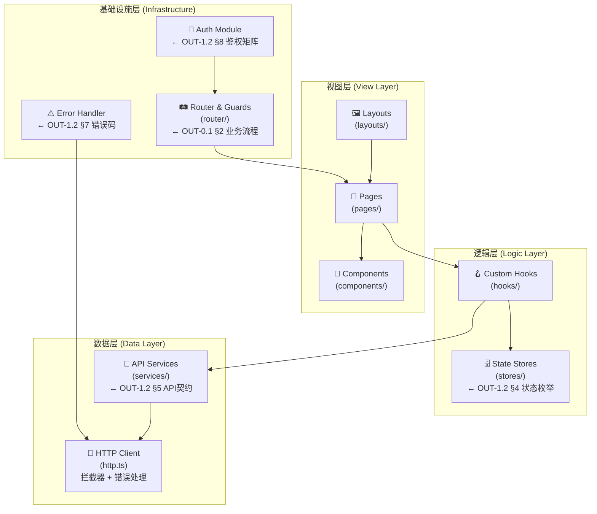
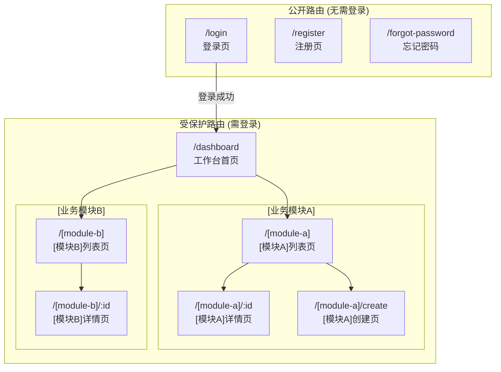
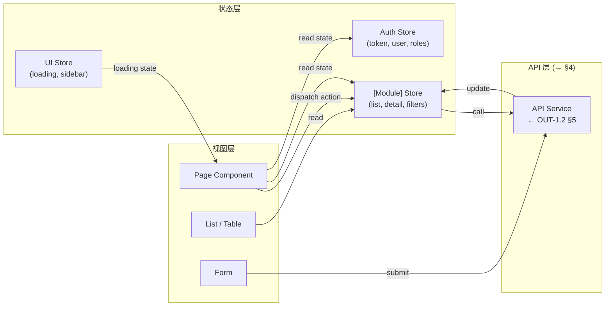
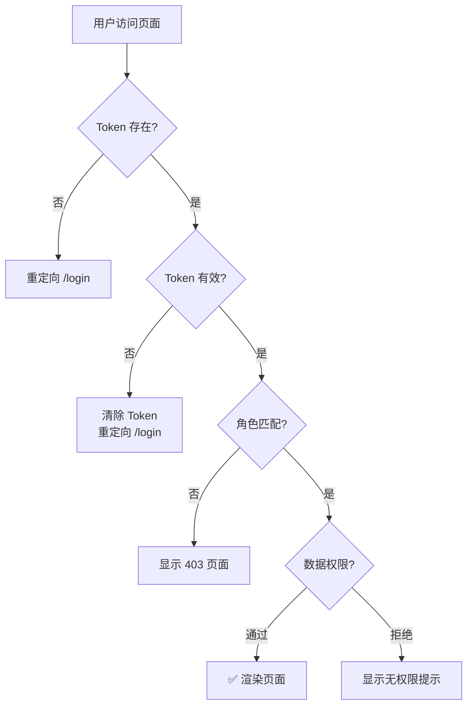

# OUT-1.1: 前端交互架构与路由管控 (Frontend Architecture & Route Control)

> ⚠️ **模版使用说明**
> 本文档是 `T_FE_P1_FrontendArch_02` 任务的标准交付物模版，由 **FE Architect (前端架构师)** 负责填写。
> 填写完成后的成品文档必须输出至 `3_final_outputs/OUT-1.1_Frontend_Arch.md`。
> 所有 `[占位符]` 必须被替换为实际内容，严禁残留空白占位符。
> **核心定位**：前端开发工程师拿到此文档后，应能**直接开始编码**，无需再追问架构师。

---

## 文档元数据 (Document Metadata)

| 属性 | 内容 |
| :--- | :--- |
| **文档编号** | OUT-1.1 |
| **Task ID** | `T_FE_P1_FrontendArch_02` |
| **生产者角色** | FE Architect (前端架构师) |
| **业务流程来源** | `OUT-0.1_Business_Process.md` — `[关联的业务流程编号，如：BP-FIN-001]` |
| **文档状态** | `[Draft / Under Review / Confirmed]` |
| **版本** | `v[X.Y]` |
| **生成时间** | `[YYYY-MM-DD]` |
| **技术栈** | `[前端框架 + 状态管理 + UI组件库 + 构建工具，如：React 18 / Zustand / Ant Design 5.x / Vite 5.x]` |

### I/O 依赖声明 (Dependency Contract)

> 本表声明本文档与上下游交付物的精确关联。填写时必须核对 `Project_Global_IO_Pipeline_Template.md` 中的 Artifact Registry。

| 方向 | Task ID | 交付物路径 (Artifact URI) | 关联说明 |
| :--- | :--- | :--- | :--- |
| **⬆️ 上游输入** | `T_PM_P0_BusinessProcess_01` | `3_final_outputs/OUT-0.1_Business_Process.md` | 业务流程图中的用户交互路径、页面跳转、权限前置条件 |
| **➡️ 平级关联** | `T_BE_P1_BackendArch_03` | `3_final_outputs/OUT-1.2_Backend_Arch.md` | 本文档 §4 API 对接层 ← OUT-1.2 §5 API契约；§3 状态管理 ← OUT-1.2 §4 状态枚举；§6 错误处理 ← OUT-1.2 §7 错误码 |
| **⬇️ 下游消费** | `T_UI_P2_UIMockups_04` | `3_final_outputs/diagrams/Figma_Export/` | 本文档 §5 组件架构 → UI 设计必须在此组件边界内 |
| **⬇️ 下游消费** | `T_QA_P3_TestCases_05` | `3_final_outputs/OUT-3.1_Test_Cases.md` | 本文档 §4 API Mock + §2 路由 → QA 前端 Mock 脚本与 E2E 路径构建 |

---

## 1. 前端架构总览 (Frontend Architecture Overview)

> 面向【前端架构师】、【前端开发】。
> 定义技术选型、项目目录结构、分层架构与构建工具链。开发人员据此搭建项目骨架。
> 【强制双轨制图】：必须在文档中使用 Mermaid 语法渲染，且必须同步生成对应的 `.drawio` 独立绘图文件。

### 1.1 技术选型

| 技术组件 | 选型 | 版本 | 用途 |
| :--- | :--- | :--- | :--- |
| **框架** | `[如：React]` | `[如：18.x]` | 主应用框架 |
| **语言** | `[如：TypeScript]` | `[如：5.x]` | 类型安全开发 |
| **构建工具** | `[如：Vite]` | `[如：5.x]` | 开发服务器 & 打包 |
| **状态管理** | `[如：Zustand / Redux Toolkit / Pinia]` | `[版本]` | 全局状态管理 |
| **UI 组件库** | `[如：Ant Design / Element Plus]` | `[版本]` | 基础 UI 组件 |
| **路由** | `[如：React Router / Vue Router]` | `[版本]` | 页面路由管理 |
| **HTTP 客户端** | `[如：Axios]` | `[版本]` | API 请求封装 |
| **表单管理** | `[如：React Hook Form / Formik]` | `[版本]` | 表单校验与提交 |
| **国际化** | `[如：react-i18next / vue-i18n]` | `[版本]` | 多语言支持 (如需要) |
| **CSS 方案** | `[如：CSS Modules / Tailwind CSS / Styled Components]` | `[版本]` | 样式隔离方案 |

### 1.2 项目目录结构

> 🔧 **开发人员指南**：以下目录结构可直接作为项目搭建骨架。

```
src/
├── app/                         # 应用入口与全局配置
│   ├── App.tsx                  # 根组件
│   ├── main.tsx                 # 入口挂载点
│   ├── router/                  # 路由配置 (→ §2)
│   │   ├── index.ts             # 路由表定义
│   │   ├── guards.ts            # 路由守卫 (→ §7)
│   │   └── routes.config.ts     # 路由常量
│   └── providers/               # 全局 Provider 组装
├── layouts/                     # 布局组件
│   ├── MainLayout.tsx           # 主框架布局 (侧边栏+顶栏+内容区)
│   ├── AuthLayout.tsx           # 登录/注册布局
│   └── BlankLayout.tsx          # 空白布局
├── pages/                       # 页面级组件 (按业务模块分组)
│   ├── [module-a]/              # [业务模块A名称]
│   │   ├── List.tsx             # 列表页
│   │   ├── Detail.tsx           # 详情页
│   │   └── components/          # 页面私有组件
│   └── [module-b]/              # [业务模块B名称]
├── components/                  # 通用组件 (→ §5)
│   ├── common/                  # 基础通用组件
│   └── business/                # 业务通用组件
├── services/                    # API 对接层 (→ §4)
│   ├── api/                     # API 接口定义
│   │   ├── [module-a].api.ts    # [模块A] API
│   │   └── [module-b].api.ts    # [模块B] API
│   ├── http.ts                  # Axios 实例 & 拦截器
│   └── mock/                    # Mock 数据 (开发阶段)
├── stores/                      # 状态管理 (→ §3)
│   ├── [module-a].store.ts      # [模块A] Store
│   └── auth.store.ts            # 鉴权状态
├── hooks/                       # 自定义 Hooks
├── utils/                       # 工具函数
├── types/                       # TypeScript 类型定义
│   ├── api.d.ts                 # API 请求/响应类型 (← OUT-1.2 §5)
│   └── enums.ts                 # 状态枚举常量 (← OUT-1.2 §4)
├── constants/                   # 全局常量
│   └── errorCodes.ts            # 错误码映射 (← OUT-1.2 §7)
├── styles/                      # 全局样式
└── assets/                      # 静态资源
```

### 1.3 分层架构图



> 📎 独立图纸文件：`diagrams/frontend_architecture.drawio`

---

## 2. 路由与页面拓扑 (Route & Page Topology)

> 面向【前端开发】。
> 定义完整路由表、页面层级与权限拦截规则。直接源自 OUT-0.1 §2 泳道图中的用户交互路径。
> **UI/UX 关联 (→ T_UI_P2_UIMockups_04)**：路由拓扑定义了 UI 页面骨架与导航结构。

### 2.1 路由拓扑图



> 📎 独立图纸文件：`diagrams/frontend_route_topology.drawio`

### 2.2 路由配置表

> 🔧 **开发人员指南**：以下路由配置可直接 copy 到 `router/routes.config.ts`。

| 路由路径 | 页面组件 | Layout | 权限要求 | 菜单可见 | 对应 OUT-0.1 步骤 | 对应 API (OUT-1.2 §5) |
| :--- | :--- | :--- | :--- | :--- | :--- | :--- |
| `/login` | `Login.tsx` | `AuthLayout` | 无需登录 | 否 | - | `POST /api/v1/auth/login` |
| `/dashboard` | `Dashboard.tsx` | `MainLayout` | `[ROLE_USER]` | 是 | - | `[聚合查询API]` |
| `/[module-a]` | `[ModuleA]List.tsx` | `MainLayout` | `[ROLE_USER]` | 是 | 步骤 [N] | `GET /api/v1/[resource]` |
| `/[module-a]/:id` | `[ModuleA]Detail.tsx` | `MainLayout` | `[ROLE_USER]` | 否 | 步骤 [N] | `GET /api/v1/[resource]/{id}` |
| `/[module-a]/create` | `[ModuleA]Create.tsx` | `MainLayout` | `[ROLE_ENTERPRISE_USER]` | 否 | 步骤 [N] | `POST /api/v1/[resource]` |
| `/[module-b]` | `[ModuleB]List.tsx` | `MainLayout` | `[ROLE_USER]` | 是 | 步骤 [N] | `GET /api/v1/[resource]` |
| `/[module-b]/:id` | `[ModuleB]Detail.tsx` | `MainLayout` | `[ROLE_USER]` | 否 | 步骤 [N] | `GET /api/v1/[resource]/{id}` |

### 2.3 路由配置代码模版

```typescript
// router/routes.config.ts
// 🔧 可直接 copy 使用

import type { RouteConfig } from '@/types/router';

export const routes: RouteConfig[] = [
  // === 公开路由 ===
  {
    path: '/login',
    component: () => import('@/pages/auth/Login'),
    layout: 'AuthLayout',
    meta: { requiresAuth: false, title: '[登录页标题]' },
  },
  // === 受保护路由 ===
  {
    path: '/dashboard',
    component: () => import('@/pages/dashboard/Dashboard'),
    layout: 'MainLayout',
    meta: { requiresAuth: true, roles: ['[ROLE_USER]'], title: '[工作台]' },
  },
  {
    path: '/[module-a]',
    component: () => import('@/pages/[module-a]/List'),
    layout: 'MainLayout',
    meta: {
      requiresAuth: true,
      roles: ['[ROLE_USER]'],
      title: '[模块A列表]',
      menuKey: '[module-a]',
    },
    children: [
      {
        path: ':id',
        component: () => import('@/pages/[module-a]/Detail'),
        meta: { title: '[模块A详情]' },
      },
      {
        path: 'create',
        component: () => import('@/pages/[module-a]/Create'),
        meta: { roles: ['[ROLE_ENTERPRISE_USER]'], title: '[创建模块A]' },
      },
    ],
  },
  // [重复上方模式为每个业务模块配置路由]
];
```

---

## 3. 状态管理设计 (State Management)

> 面向【前端开发】。
> 定义全局 Store 数据模型与数据流方向。状态枚举直接映射 OUT-1.2 §4 状态机定义。
> **来源**：OUT-0.1 §3 数据矩阵中的核心字段。
> **UI/UX 关联 (→ T_UI_P2_UIMockups_04)**：Store 数据模型约束了 UI 可展示的数据范围。

### 3.1 Store 模块划分

| Store 模块 | 文件路径 | 职责 | 数据来源 (API) | 缓存策略 |
| :--- | :--- | :--- | :--- | :--- |
| **Auth Store** | `stores/auth.store.ts` | 用户登录态、Token、角色信息 | `POST /api/v1/auth/login` | 持久化 (localStorage) |
| **[ModuleA] Store** | `stores/[module-a].store.ts` | [模块A]列表/详情数据、筛选条件 | `GET /api/v1/[resource]` | 内存缓存，切换页面失效 |
| **[ModuleB] Store** | `stores/[module-b].store.ts` | [模块B]列表/详情数据 | `GET /api/v1/[resource]` | 内存缓存 |
| **UI Store** | `stores/ui.store.ts` | 侧边栏折叠态、全局 Loading、通知栏 | - | 内存 (不持久化) |

### 3.2 状态枚举映射 (← OUT-1.2 §4)

> ⚠️ **镜像对齐规则**：以下枚举必须与 OUT-1.2 §4.2 状态枚举定义**一一对应**，不可自行增删状态值。

```typescript
// types/enums.ts
// ← 直接映射 OUT-1.2 §4.2 状态枚举

/**
 * [业务对象名称] 状态枚举
 * 来源: OUT-1.2 §4.2 [EntityName]Status
 * 用途: 列表页状态标签渲染 (文案 + 颜色)
 */
export enum [EntityName]Status {
  STATE_A = [code],       // [中文标签]
  STATE_B = [code],       // [中文标签]
  STATE_SUCCESS = [code], // [中文标签]
  STATE_FAILED = [code],  // [中文标签]
  STATE_VOID = [code],    // [中文标签]
}

/** 状态标签配置 (供列表页渲染) */
export const [ENTITY_NAME]_STATUS_CONFIG: Record<[EntityName]Status, {
  label: string;
  color: string;
  description: string;
}> = {
  [[EntityName]Status.STATE_A]: {
    label: '[中文标签]',
    color: '[色值，如：#1890FF]',  // ← OUT-1.2 §4.2 color 字段
    description: '[Tooltip描述]',
  },
  [[EntityName]Status.STATE_B]: {
    label: '[中文标签]',
    color: '[色值，如：#FAAD14]',
    description: '[Tooltip描述]',
  },
  // [为 OUT-1.2 §4.2 中的每个状态值填写]
};
```

### 3.3 数据流架构图



---

## 4. API 对接层 (API Integration Layer)

> 面向【前端开发】。
> 🔧 **开发人员指南**：本节 API Service 封装直接消费 OUT-1.2 §5 API 契约，前端据此直接编写接口层代码。
> **镜像对齐**：OUT-1.2 §5.1 接口总览中的每一个 API，在此处必须有对应的 Service 方法。

### 4.1 HTTP 客户端配置

```typescript
// services/http.ts
// 🔧 可直接 copy 使用

import axios, { type AxiosInstance, type AxiosRequestConfig, type AxiosResponse } from 'axios';
import { useAuthStore } from '@/stores/auth.store';
import { handleApiError } from '@/utils/errorHandler'; // → §6

const http: AxiosInstance = axios.create({
  baseURL: import.meta.env.VITE_API_BASE_URL || '/api/v1',
  timeout: [超时时间，如：15000], // ms
  headers: { 'Content-Type': 'application/json' },
});

// === 请求拦截器 ===
http.interceptors.request.use((config) => {
  const { token } = useAuthStore.getState();
  if (token) {
    config.headers.Authorization = `Bearer ${token}`;
  }
  // [可选：添加请求ID、语言头等]
  return config;
});

// === 响应拦截器 ===
http.interceptors.response.use(
  (response: AxiosResponse<ApiResponse>) => {
    const { code, message, data } = response.data;
    if (code === 0) return data; // 业务成功
    // 业务失败 → 交由 §6 错误处理
    handleApiError(code, message);
    return Promise.reject({ code, message });
  },
  (error) => {
    // HTTP 级别错误 (网络/超时等)
    handleApiError(error.response?.status ?? -1, error.message);
    return Promise.reject(error);
  }
);

export default http;
```

### 4.2 API Service 接口定义

> ⚠️ 以下模版需为 OUT-1.2 §5.1 接口总览中的**每一个 API** 编写对应的 Service 方法。严禁遗漏。

```typescript
// services/api/[module-a].api.ts
// ← 直接映射 OUT-1.2 §5 API 契约

import http from '../http';
import type {
  [RequestType],
  [ResponseType],
  PaginatedResponse,
} from '@/types/api';

/**
 * [接口描述]
 * ← OUT-1.2 §5.2 API-[N]
 * 对应 OUT-0.1 步骤 [N]: [步骤名称]
 */
export function [apiMethodName](params: [RequestType]): Promise<[ResponseType]> {
  return http.[method]('/[resource]/[action]', params);
}

/**
 * [列表查询接口描述]
 * ← OUT-1.2 §5.2 API-[N]
 */
export function get[Resource]List(params: {
  page?: number;
  page_size?: number;
  [筛选参数]?: [类型];
}): Promise<PaginatedResponse<[ResourceItem]>> {
  return http.get('/[resource]', { params });
}

/**
 * [详情查询接口描述]
 * ← OUT-1.2 §5.2 API-[N]
 */
export function get[Resource]Detail(id: number): Promise<[ResourceDetail]> {
  return http.get(`/[resource]/${id}`);
}

// [为 OUT-1.2 §5.1 中的每一个 API 编写对应方法]
```

### 4.3 TypeScript 类型定义

```typescript
// types/api.d.ts
// ← 直接映射 OUT-1.2 §5.2 各接口的请求/响应结构

/** 通用 API 响应包装 */
interface ApiResponse<T = any> {
  code: number;       // 0=成功, 非0=失败 (→ §6 错误码)
  message: string;
  data: T;
}

/** 分页响应 */
interface PaginatedResponse<T> {
  list: T[];
  total: number;
  page: number;
  page_size: number;
}

// === [模块A] 类型定义 (← OUT-1.2 §3 Schema + §5 响应体) ===

/** [资源] 列表项 */
interface [ResourceItem] {
  id: number;
  [字段名]: [TypeScript类型];  // [字段描述] ← OUT-1.2 §3 t_[表名].[字段名]
  status: [EntityName]Status;   // ← OUT-1.2 §4 状态枚举
  created_at: string;
}

/** [资源] 详情 */
interface [ResourceDetail] extends [ResourceItem] {
  [详情额外字段]: [类型];
}

/** [资源] 创建请求 */
interface Create[Resource]Request {
  [参数名]: [类型];  // [参数描述] ← OUT-1.2 §5.2 API-[N] 请求参数
}
```

### 4.4 Mock 策略 (开发阶段)

> **QA 关联 (→ T_QA_P3_TestCases_05)**：QA 可直接复用以下 Mock 数据编写测试用例。

```typescript
// services/mock/[module-a].mock.ts

import type { [ResourceItem] } from '@/types/api';
import { [EntityName]Status } from '@/types/enums';

export const mock[Resource]List: [ResourceItem][] = [
  {
    id: 1,
    [字段名]: '[Mock示例值]',
    status: [EntityName]Status.STATE_A,
    created_at: '2025-01-01T00:00:00Z',
  },
  // [为每种状态至少提供一条 Mock 数据]
];
```

---

## 5. 组件架构 (Component Architecture)

> 面向【前端开发】、**【UI/UX 设计师】**。
> **核心约束 (→ T_UI_P2_UIMockups_04)**：UI 设计必须在此组件边界内进行，不可凭空创造本节未定义的组件类型。
> **数据绑定来源**：组件可展示的字段严格来源于 OUT-1.2 §3 Schema。

### 5.1 组件分层规范

| 组件层级 | 目录 | 职责 | 示例 | UI/UX 约束 |
| :--- | :--- | :--- | :--- | :--- |
| **基础通用** | `components/common/` | 纯 UI 组件，无业务逻辑 | `StatusTag`, `ConfirmModal`, `ErrorBanner` | 设计师可自定义样式 |
| **业务通用** | `components/business/` | 跨模块复用的业务组件 | `[BusinessComponent]`, `[SharedWidget]` | 遵循统一设计规范 |
| **页面私有** | `pages/[module]/components/` | 仅限特定页面使用 | `[PageSpecificForm]`, `[DetailPanel]` | 设计师按页面场景设计 |

### 5.2 关键业务组件清单

> ⚠️ 以下组件是 UI/UX 设计的**必要约束输入**。设计师必须为每个组件提供视觉稿。

| 组件名 | 类型 | 功能描述 | 数据来源 (OUT-1.2) | 对应页面路由 |
| :--- | :--- | :--- | :--- | :--- |
| `StatusTag` | 基础通用 | 按状态枚举渲染彩色标签 | §4 状态枚举 (label + color) | 所有列表页 |
| `[Resource]Table` | 业务通用 | [资源]列表表格，含分页/筛选 | §3 Schema + §5 列表 API | `/[module-a]` |
| `[Resource]Form` | 页面私有 | [资源]创建/编辑表单 | §5 创建 API 请求参数 | `/[module-a]/create` |
| `[Resource]DetailCard` | 页面私有 | [资源]详情信息卡片 | §5 详情 API 响应体 | `/[module-a]/:id` |
| `ErrorPrompt` | 基础通用 | 统一错误提示 (Toast/Modal/Banner) | §7 错误码 → 提示类型 | 全局 |

### 5.3 组件接口规范 (Props 定义)

```typescript
// components/common/StatusTag.tsx

interface StatusTagProps {
  /** 状态值 ← OUT-1.2 §4.2 枚举 code */
  status: [EntityName]Status;
  /** 是否显示 Tooltip 描述 */
  showTooltip?: boolean;
}

/**
 * 状态标签组件
 * 根据 OUT-1.2 §4.2 的 label + color 渲染
 * UI/UX: 设计师需为每种颜色提供 Tag 视觉稿
 */
export function StatusTag({ status, showTooltip = true }: StatusTagProps) {
  const config = [ENTITY_NAME]_STATUS_CONFIG[status];
  // [渲染逻辑]
}
```

---

## 6. 错误处理与用户反馈 (Error Handling & User Feedback)

> 面向【前端开发】、**【UI/UX 设计师】**。
> **直接消费 OUT-1.2 §7 错误码体系**：每个错误码必须在此映射到对应的前端提示策略。
> **来源**：OUT-0.1 §5 异常边界。
> **UI/UX 关联 (→ T_UI_P2_UIMockups_04)**：设计师需为 Toast / Modal / Banner 三种提示类型提供视觉稿。

### 6.1 错误码前端映射表 (← OUT-1.2 §7.2)

> ⚠️ **镜像对齐规则**：OUT-1.2 §7.2 中的每一个错误码，必须在此有对应的前端处理策略。

| 错误码 (← OUT-1.2) | 提示类型 | 用户提示文案 | 前端处理逻辑 | UI/UX 约束 |
| :--- | :--- | :--- | :--- | :--- |
| `0` | - | - | 正常处理 | - |
| `[XXXXX]` | `Toast` | `[用户友好文案]` | `[如：刷新列表]` | 3秒自动消失 |
| `[XXXXX]` | `Modal` | `[阻断性错误文案]` | `[如：阻止提交，引导修正]` | 需手动关闭 |
| `[50001]` | `Modal` | "系统繁忙，请稍后重试" | 显示"重试"按钮 | 全屏遮罩 |
| `[50002]` | `Banner` | `[降级提示文案]` | `[如：禁用相关功能入口]` | 页面顶部持续展示 |
| `401` | `Modal` | "登录已过期，请重新登录" | 清除 Token，跳转 `/login` | - |
| `403` | `Toast` | "您没有权限执行此操作" | 保持当前页面 | - |

### 6.2 错误处理工具函数

```typescript
// utils/errorHandler.ts
// ← 直接对齐 OUT-1.2 §7 错误码

import { ERROR_CODE_CONFIG } from '@/constants/errorCodes';

type PromptType = 'toast' | 'modal' | 'banner';

interface ErrorConfig {
  type: PromptType;
  message: string;
  action?: () => void; // 附加动作 (如跳转登录页)
}

/**
 * 全局 API 错误处理入口
 * 由 §4.1 HTTP 响应拦截器调用
 */
export function handleApiError(code: number, serverMsg: string): void {
  const config = ERROR_CODE_CONFIG[code];
  if (!config) {
    // 未映射的错误码 → 通用兜底
    showToast(serverMsg || '操作失败，请重试');
    return;
  }
  switch (config.type) {
    case 'toast':
      showToast(config.message);
      break;
    case 'modal':
      showErrorModal(config.message, config.action);
      break;
    case 'banner':
      showBanner(config.message);
      break;
  }
}
```

### 6.3 错误码常量配置

```typescript
// constants/errorCodes.ts
// ← 逐条映射 OUT-1.2 §7.2

export const ERROR_CODE_CONFIG: Record<number, ErrorConfig> = {
  [XXXXX]: { type: 'toast', message: '[用户提示文案]' },
  [XXXXX]: { type: 'modal', message: '[用户提示文案]' },
  50001:   { type: 'modal', message: '系统繁忙，请稍后重试' },
  50002:   { type: 'banner', message: '[降级提示文案]' },
  // [为 OUT-1.2 §7.2 中的每一个错误码填写]
};
```

---

## 7. 权限与路由守卫 (Auth & Route Guards)

> 面向【前端开发】。
> 定义前端鉴权机制与路由拦截逻辑。映射 OUT-1.2 §8 鉴权矩阵。
> **来源**：OUT-0.1 §1 前置条件中的权限要求。
> **UI/UX 关联 (→ T_UI_P2_UIMockups_04)**：约束 UI 中的元素可见性与操作权限。

### 7.1 鉴权流程图



### 7.2 路由守卫实现

```typescript
// router/guards.ts
// ← 映射 OUT-1.2 §8.1 接口鉴权矩阵

import { useAuthStore } from '@/stores/auth.store';

export function beforeEachGuard(to: RouteLocation, from: RouteLocation): NavigationResult {
  const { token, user } = useAuthStore.getState();
  // 1. 无需鉴权的路由直接放行
  if (!to.meta.requiresAuth) return true;
  // 2. 未登录 → 重定向登录页
  if (!token) return { path: '/login', query: { redirect: to.fullPath } };
  // 3. 角色校验 ← OUT-1.2 §8.1 权限要求
  if (to.meta.roles && !to.meta.roles.includes(user.role)) {
    return { path: '/403' };
  }
  // 4. 数据权限过滤 (← OUT-1.2 §8.1 数据隔离策略)
  // [如：企业用户只能访问自己企业数据]
  return true;
}
```

### 7.3 权限控制矩阵 (← OUT-1.2 §8.1)

| 功能模块 | 页面/操作 | `[ROLE_USER]` | `[ROLE_ENTERPRISE_USER]` | `[ROLE_ADMIN]` | 数据隔离 |
| :--- | :--- | :--- | :--- | :--- | :--- |
| [模块A] | 查看列表 | ✅ | ✅ | ✅ | 仅本企业 |
| [模块A] | 查看详情 | ✅ | ✅ | ✅ | 仅本企业 |
| [模块A] | 创建 | ❌ | ✅ | ✅ | - |
| [模块B] | 查看列表 | ✅ | ✅ | ✅ | 仅本企业 |
| [模块B] | 下载文件 | ✅ | ✅ | ✅ | 仅本人 |
| 管理功能 | 全局管理 | ❌ | ❌ | ✅ | 全局可见 |

---

## 8. 性能与工程规范 (Performance & Engineering Standards)

> 面向【前端开发】。
> 定义代码分割、懒加载、Bundle 优化与编码规范。

### 8.1 性能优化策略

| 优化项 | 策略 | 实现方式 |
| :--- | :--- | :--- |
| **代码分割** | 路由级懒加载 | `React.lazy()` / `defineAsyncComponent()` + `Suspense` |
| **组件懒加载** | 大型业务组件按需加载 | 动态 `import()` |
| **数据缓存** | 列表数据本地缓存 | Store 层缓存 + TTL 策略 |
| **图片优化** | 图片懒加载 + WebP 格式 | `IntersectionObserver` + CDN 处理 |
| **请求优化** | 接口防抖/节流/取消 | Axios `CancelToken` / `AbortController` |
| **Bundle 分析** | 依赖体积监控 | `rollup-plugin-visualizer` |

### 8.2 编码规范

| 规范项 | 标准 |
| :--- | :--- |
| **代码格式化** | `[Prettier + ESLint]` 统一配置 |
| **命名规范** | 组件 PascalCase / 文件 kebab-case / 变量 camelCase |
| **Git 规范** | `[Conventional Commits]`: `feat:` / `fix:` / `refactor:` |
| **类型安全** | 严禁 `any`，所有 API 类型必须从 `types/api.d.ts` 引用 |
| **注释规范** | 组件/函数必须有 JSDoc，标注数据来源 (如 `← OUT-1.2 §5.2 API-3`) |

### 8.3 开发环境配置

```
// .env.development
VITE_API_BASE_URL=[开发环境 API 地址，如：http://localhost:8080/api/v1]
VITE_MOCK_ENABLED=[是否启用 Mock, true/false]

// .env.production
VITE_API_BASE_URL=[生产环境 API 地址]
VITE_MOCK_ENABLED=false
```

---

## 9. 跨团队影响映射 (Cross-Team Impact Matrix)

> 本章明确 OUT-1.1 各章节对其他 Task 交付物的**具体影响与约束关系**。
> 下游团队（UI/UX、QA）必须据此锁定各自的设计与实现边界。
> 与 OUT-1.2 §9 互为镜像、互不矛盾。

| 本文档内容模块 | 下游消费任务 | 具体影响 | 关联引用 |
| :--- | :--- | :--- | :--- |
| **§2 路由与页面拓扑** | `T_UI_P2_UIMockups_04` | UI 设计页面骨架与导航结构必须与路由拓扑一致 | §2.1 路由拓扑图 + §2.2 路由配置表 |
| **§3 状态枚举映射** | `T_UI_P2_UIMockups_04` | 各状态的视觉设计 (颜色、标签文案) 必须与 §3.2 一致 | §3.2 状态枚举映射 |
| **§5 组件架构** | `T_UI_P2_UIMockups_04` | **核心约束**：UI 设计必须在 §5 定义的组件边界内，不可自创组件类型 | §5.1 组件分层 + §5.2 组件清单 |
| **§6 错误处理** | `T_UI_P2_UIMockups_04` | 设计师需为 Toast / Modal / Banner 三种提示类型提供视觉稿 | §6.1 错误码映射表 |
| **§7 权限控制矩阵** | `T_UI_P2_UIMockups_04` | 约束 UI 中元素的可见/隐藏/禁用状态 | §7.3 权限控制矩阵 |
| **§4 API 对接层 (Mock)** | `T_QA_P3_TestCases_05` | QA 可直接复用 Mock 数据编写前端 E2E 测试 | §4.4 Mock 策略 |
| **§2 路由拓扑** | `T_QA_P3_TestCases_05` | QA 据此构建完整的页面导航测试路径 | §2.1 路由拓扑图 |
| **§6 错误处理** | `T_QA_P3_TestCases_05` | QA 需验证每个错误码是否正确触发对应的提示类型 | §6.1 错误码映射表 |
| **§7 权限守卫** | `T_QA_P3_TestCases_05` | QA 需测试越权访问场景 (未登录/角色不匹配/数据隔离) | §7.2 路由守卫 + §7.3 权限矩阵 |

> **与 OUT-1.2 的反向引用**：
> - 本文 §3 状态枚举 ← OUT-1.2 §4 状态机 (镜像消费)
> - 本文 §4 API 对接层 ← OUT-1.2 §5 API 契约 (逐条消费)
> - 本文 §6 错误处理 ← OUT-1.2 §7 错误码体系 (逐条消费)
> - 本文 §7 权限守卫 ← OUT-1.2 §8 鉴权矩阵 (映射消费)
