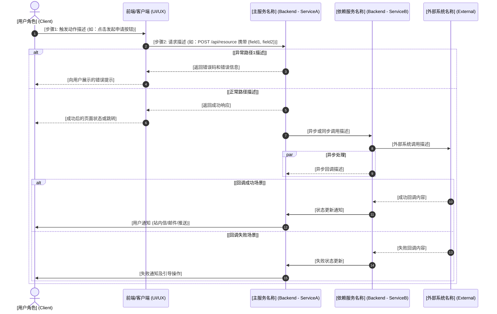

# OUT-0.1: 业务流程图与PRD元数据 (Business Process & PRD)

**文档元数据**
* **流程编号 (Process ID)**: `BP-[领域缩写]-[编号]` (如：BP-FIN-001, BP-ORD-001)
* **业务流程名称**: `[此处填写业务流程名称]`
* **负责人 (Owner)**: `[PM或业务负责人姓名]`
* **文档状态**: `[Draft / Under Review / Confirmed]`
* **生成时间**: `[YYYY-MM-DD]`
* **版本**: `v1.0`

---

## 1. 流程元数据 (Process Metadata)
> 用于 PRD 归档、版本追踪和整体目标对齐。

| 属性 | 内容 |
| :--- | :--- |
| **业务目标 (Business Objective)** | `[一句话描述：允许哪个角色，针对什么对象，完成什么核心操作，实现什么商业价值]` |
| **触发条件 (Trigger)** | `[什么事件/用户行为触发该流程的启动]` |
| **前置条件 (Pre-conditions)** | `[1. 前置条件一 (如：用户处于已登录状态) 2. 前置条件二]` |
| **后置状态 (Post-conditions)** | `[流程正常完成后，系统和业务对象的最终状态描述]` |
| **主要参与者 (Primary Actors)** | `[用户角色1, 用户角色2, 外部系统1]` |
| **关联业务对象 (Domain Entities)** | `[Order, Invoice, User, Product... — 列出流程中被创建/修改/读取的核心业务实体]` |

---

## 2. 跨职能泳道图 (Cross-Functional Swimlane Diagram)
> 【视觉核心】面向所有角色，明确"谁、在什么阶段、做了什么操作、产生什么流转"。
> 使用 Mermaid sequenceDiagram 语法渲染，方便版本控制。同时提供 `.drawio` 独立文件。

> 📎 独立图纸文件：`diagrams/bp_swimlane.drawio`

---

## 3. 核心节点数据矩阵 (Node & Data Matrix)
> 面向【架构师】、【后端】、【UI/UX】。
> 将图中每个关键动作剥离出来，明确该动作所需的输入、输出以及系统内部状态变化。
> 这是从"业务语言"转化为"技术架构语言"的关键桥梁。

| 步骤编号 | 节点动作名称 | 动作触发方 | 核心字段输入 (Input Fields) | 核心字段输出 (Output Fields) | 状态机变更 / 领域行为 | 依赖的外部系统 |
| :--- | :--- | :--- | :--- | :--- | :--- | :--- |
| **步骤 [N]** | `[动作名，如：创建申请单]` | `[触发方：用户/前端/ServiceA]` | `[field1 (类型), field2 (类型)]` | `[result_id (申请ID), status]` | `[实体名] 状态从 [A] 变更为 [B]；触发 [副作用]` | `[外部系统名称 / 无]` |
| **步骤 [N+1]** | `[...]` | `[...]` | `[...]` | `[...]` | `[...]` | `[...]` |

---

## 4. 前端交互与埋点说明 (UI/UX & Tracking)
> 面向【前端】与【UI/UX 设计师】。
> 说明流程在界面上的具体表现形式和关键交互断点。

* **[入口位置]**: `[描述用户如何进入该流程，如：导航菜单 -> 模块A -> 子功能B]`
* **[关键表单校验规则]**: `[描述前端必须执行的输入校验逻辑，如：金额字段不能为负数；提交按钮在必填项未完成前 Disabled]`
* **[异常提示交互]**: `[描述各类错误的展示方式，如：轻错误用 Toast；严重错误用 Modal 强弹窗；异步失败在消息中心展示]`
* **[加载态与中间状态]**: `[描述异步操作期间的 UI 状态，如：提交后按钮显示 Loading；状态为 PENDING 时列表展示进度条]`
* **[数据埋点需求]**: `[描述需要统计的用户行为漏斗，如：Event: submit_success 统计从入口到提交成功的转化率]`

---

## 5. 异常与逆向防御边界 (Exception & Edge Cases)
> 面向【QA 测试团队】与【架构师】。
> 这是产生 Bug 最多的地方。必须明确定义当"意外情况"发生时，流程如何阻断或恢复。
> ⚠️ 每条 Exception 场景直接对应 `T_QA_P3_TestCases_05` 的一个测试用例。不可省略。

| 场景编号 | 异常/逆向场景描述 | 系统预期处理规则 (业务防线) | QA 测试重点 |
| :--- | :--- | :--- | :--- |
| **E-01** | `[并发/重复操作场景，如：用户在两个设备同时提交同一笔请求]` | `[防线描述，如：后端使用分布式锁/幂等 Key 确保同一请求只处理一次]` | `[测试焦点，如：高并发下数据是否重复创建]` |
| **E-02** | `[外部系统故障场景，如：第三方接口超时/宕机]` | `[防线描述，如：设置超时时间 X 秒，触发重试 N 次，最终降级处理]` | `[测试焦点，如：模拟外部系统断网的降级行为]` |
| **E-03** | `[数据边界场景，如：金额精度丢失/空值/极大值]` | `[防线描述，如：以最小单位整数计算，后端强校验与前端展示值的一致性]` | `[测试焦点，如：边界值测试用例构建]` |
| **E-0N** | `[...]` | `[...]` | `[...]` |

---

## 6. 【上下文流转】OUT-0.1 对下游架构节点的影响映射
> 说明本流程文档中的各要素，如何分别成为下游各专属 Agent 任务的输入依据。

| 本文档内容模块 | 下游消费任务 | 具体传导逻辑 |
| :--- | :--- | :--- |
| **泳道图 + 节点数据矩阵 (§2 + §3)** | `T_BE_P1_BackendArch_03` | 节点矩阵中的状态机变更直接定义后端领域模型、服务边界和 API 接口输入输出 |
| **泳道图路由 + 权限拦截节点 (§2)** | `T_FE_P1_FrontendArch_02` | 页面跳转路径、角色权限拦截点、前端需调用的接口列表 |
| **UI/UX 交互说明 + 埋点 (§4)** | `T_UI_P2_UIMockups_04` | 页面组件状态、错误展示规范、漏斗路径作为 Mockup 设计的交互约束 |
| **异常与边界场景 (§5)** | `T_QA_P3_TestCases_05` | 每条 E-0N 场景直接转化为一个集成测试用例，含测试场景描述和预期行为 |
