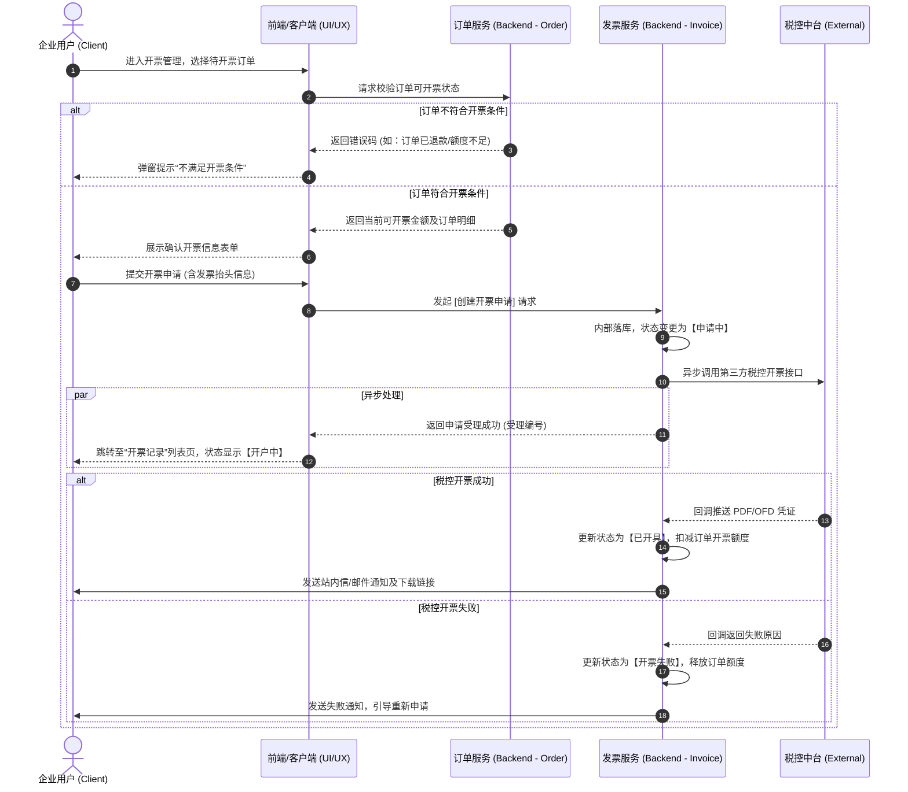

# 业务流程：[此处填写业务流程名称，如：企业用户发票开具流程]

## 1. 流程元数据 (Metadata)
> 用于 PRD 归档、版本追踪和整体目标对齐。

| 属性 | 内容 |
| :--- | :--- |
| **流程编号** | BP-FIN-001 (Business Process - Finance - 001) |
| **负责人** | [PM或业务负责人姓名] |
| **业务目标** | 允许经过企业认证的用户，针对已完结的订单申请开具增值税专用发票。 |
| **前置条件** | 1. 用户必须处于“已登录”状态   2. 用户所在企业账号必须完成“企业实名认证”与“开票资质审核”   3. 存在至少一笔状态为“已完成”且“未开票”的订单 |
| **后置状态** | 系统生成开票记录，扣减对应订单的可开票额度，并向用户发送开票成功/失败通知。 |

---

## 2. 跨职能泳道图 (Cross-Functional Swimlane Diagram)
> 【视觉核心】面向所有角色，明确“谁、在什么阶段、做了什么操作、产生什么流转”。
> 建议使用 Mermaid 语法直接在文档中渲染，方便后续版本控制和修改，无需外部画图软件拖拽。

---

## 3. 核心节点数据矩阵 (Node & Data Matrix)
> 面向【架构师】、【后端】、【UI/UX】。
> 将图中的每一个关键动作剥离出来，明确该动作所需的输入、输出以及系统内部状态变化。这是从“业务语言”转化为“技术架构语言”的关键。

| 步骤编号 | 节点动作名称 | 动作触发方 | 核心字段输入 (Input Req) | 核心字段输出 (Output Res) | 状态机变更 / 领域行为 | 依赖的外部系统 |
| :--- | :--- | :--- | :--- | :--- | :--- | :--- |
| **步骤 2** | 校验开票状态 | 前端 UI | `order_ids` (订单ID列表) | `available_amount` (可开票金额), `status` (校验结果) | - | - |
| **步骤 5** | 创建开票申请 | 前端 UI | `order_ids`, `invoice_title_id`, `amount` | `invoice_apply_id` (申请单号) | 发票记录状态设为 `PENDING` | - |
| **步骤 7** | 异步请求税控 | 发票服务 | `tax_code`, `company_name`, `amount` | `tax_request_ticket` | - | 阿里云百望云税控API |
| **步骤 10** | 接收成功回调 | 税控中台 | `ticket`, `pdf_url`, `tax_serial_no` | `ACK` | 1. 发票状态 `PENDING` -> `SUCCESS`   2. 订单可开票额度 `-amount` | - |
| **步骤 13** | 接收失败回调 | 税控中台 | `ticket`, `error_code`, `error_msg` | `ACK` | 发票状态 `PENDING` -> `FAILED` | - |

---

## 4. 前端交互与埋点说明 (UI/UX & Tracking)
> 面向【前端】与【UI/UX 设计师】。
> 说明流程图在界面上的具体表现形式和关键交互断点。

* **[入口位置]**：企业控制台 -> 财务管理 -> 订单开票
* **[表单校验规则]**：开票金额不能大于订单剩余可开票金额总和；提交按钮在输入框未填满前处于 `Disabled` 状态。
* **[异常提示交互]**：步骤 3（订单不符合条件）时，使用 `Toast` 轻提示；步骤 13（开票失败通知）需在系统的全局系统消息中心展示。
* **[数据埋点需求]**：需要统计从“进入开票页”到“成功提交开票申请”的**漏斗转化率** (Event ID: `invoice_apply_submit_success`)。

---

## 5. 异常与逆向防御边界 (Exception & Edge Cases)
> 面向【QA 测试团队】与【架构师】。
> 这是产生 Bug 最多的地方。必须明确定义当“意外情况”发生时，流程应该如何阻断或恢复。

| 场景编号 | 异常/逆向场景描述 | 系统预期处理规则 (业务防线) | QA 测试重点 |
| :--- | :--- | :--- | :--- |
| **E-01** | 并发提交：用户在多台设备同时勾选相同订单发起开票。 | **后端防重**：发起申请（步骤5）时必须加分布式锁，确保同一笔订单同一时刻只能生成一笔有效申请。 | 高并发下金额是否超扣。 |
| **E-02** | 第三方超时：税控中台 (Tax) 接口宕机或响应超时超过 5 秒。 | **异步重试+降级**：发票状态保持 `PENDING`，系统每 15 分钟触发一次重试，重试 3 次后自动标记为 `FAILED` 并通知人工客服介入。 | 模拟外部接口超时断网场景。|
| **E-03** | 精度丢失：多笔小额订单合并开票，出现 0.01 元的精度误差。 | **后端强校验**：以分为单位进行整数计算，不允许前端传入的总金额与后端累加金额存在误差。 | 构建边界值测试用例。|
